# AirAware for ATAK — User Guide

**Version 0.2 · takwerx**

**Download AirAware 0.2** (pick the one matching your ATAK-CIV version, sideload, then load it in ATAK's Plugins manager):

- **ATAK-CIV 5.6:** https://github.com/takwerx/air-aware/releases/download/v0.2/ATAK-Plugin-AirAware-0.2--5.6.0-civ-release.apk
- **ATAK-CIV 5.7:** https://github.com/takwerx/air-aware/releases/download/v0.2/ATAK-Plugin-AirAware-0.2--5.7.0-civ-release.apk
- **ATAK-CIV 5.8:** https://github.com/takwerx/air-aware/releases/download/v0.2/ATAK-Plugin-AirAware-0.2--5.8.0-civ-release.apk

All releases: https://github.com/takwerx/air-aware/releases

AirAware answers one question for anyone working under or in the air: **what is
in the column of air I am in, and what am I allowed to do here.** Six layers
draw on the map, each switched on its own, and a UAS flight planner works out
the ceiling a mission area needs.

Everything is drawn on your device. Nothing is sent to a TAK Server, nothing is
shared with other users, and nothing about you or your position leaves the
phone.

---

## Before you start

- **ATAK versions.** Version 0.2 is published for ATAK-CIV 5.6, 5.7 and 5.8.
  A plugin built for another ATAK version will not load.
- **Everything here is advisory.** AirAware is not a substitute for current
  charts and NOTAMs, and it is not a clearance. Check the official source
  before you fly.
- **Network for the first look at an area.** Each layer downloads what it needs
  for where you are looking, then works from what the phone holds. A phone that
  has seen an area once can show it again with no signal.
- **Elevation data** is needed by the UAS flight planner only. It reads the
  elevation loaded in ATAK and needs DTED2 (30 m posts) or finer; the Map Depot
  plugin can download it. With coarser data the planner says so and paints
  nothing, because a ridge between kilometer posts is simply not in the file.

---

## Opening it

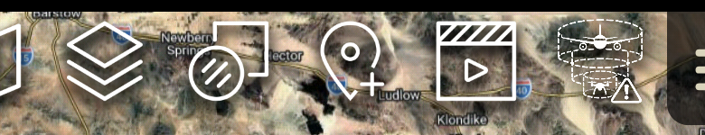

Open AirAware from the ATAK toolbar. The pane opens at half width.

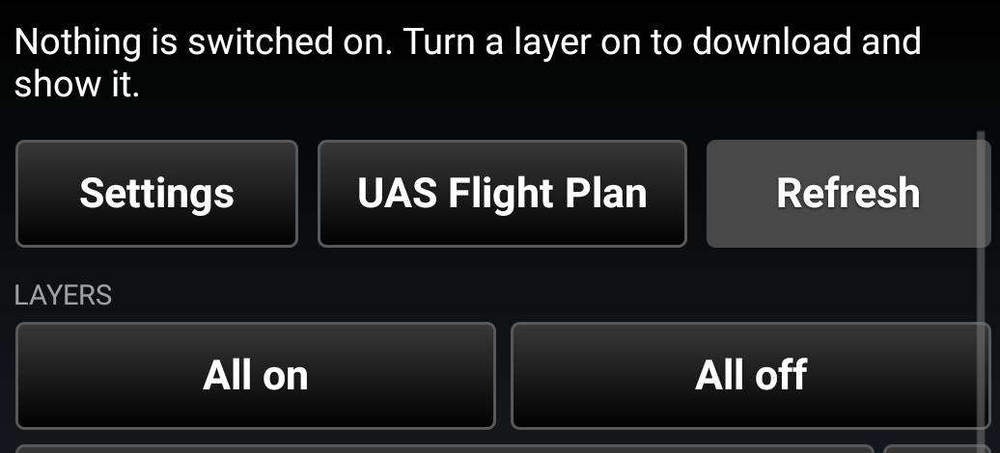

Three buttons across the top:

- **Settings** opens the page that holds everything set once and left.
- **UAS Flight Plan** opens the planner, which is its own screen.
- **Refresh** asks for restrictions and airfield conditions again now.

Under them, **LAYERS**, with **All on** and **All off**.

---

## The layers

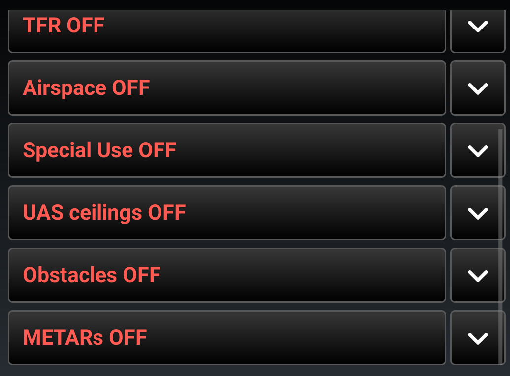

One row per layer. The row itself is the switch: it reads the layer's name with
**ON** in green or **OFF** in red, and tapping it turns the layer on or off.

Switching a layer off **hides** it. Nothing is deleted, so a layer you turned
off before losing signal comes back when you turn it on again.

The arrow on the right opens that layer's own settings and a line saying what
it is showing right now. The arrow works while the layer is off, so a layer can
be set up before it is switched on.

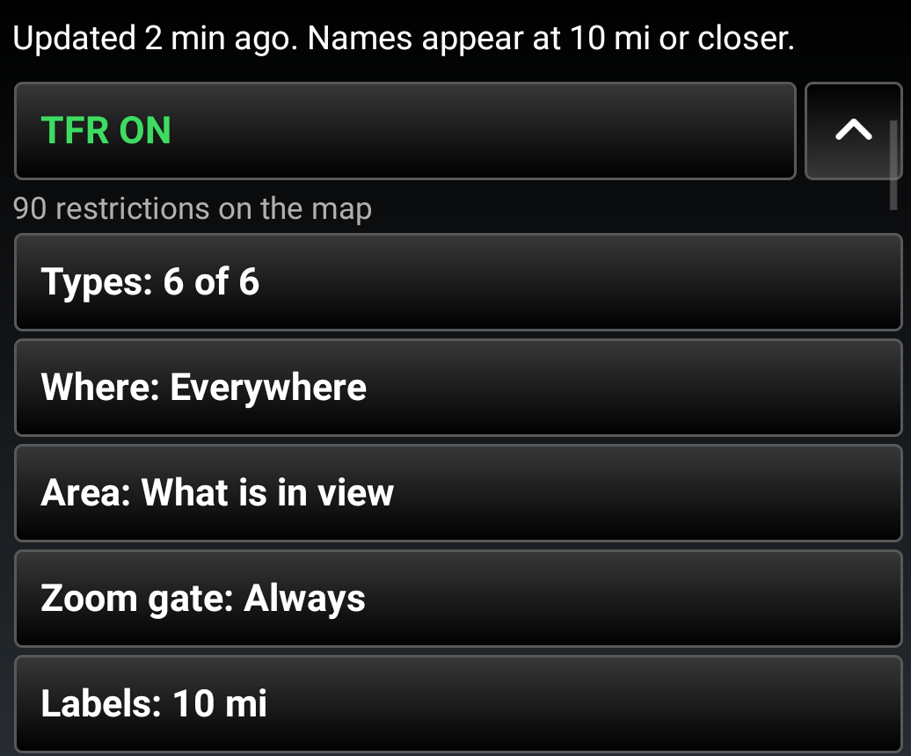

Each layer carries only what belongs to it:

| Layer | Its own settings |
|---|---|
| TFR | Types, Where, Area, Zoom gate, Labels |
| Airspace | Classes, Show at, 3D, Names on the map |
| Special Use | Kinds, Show at, 3D, Names on the map |
| UAS ceilings | Show at |
| Obstacles | Kinds, Taller than, Show at |
| METARs | Show at |

**Show at** and **Zoom gate** are read off ATAK's own scale bar. Pick the
distance the bar has to read before the layer draws, and the layer stays out of
the way until you are close enough for it to mean something.

---

## TFR

Temporary Flight Restrictions as the FAA publishes them, drawn as a volume from
the published floor to the published ceiling.

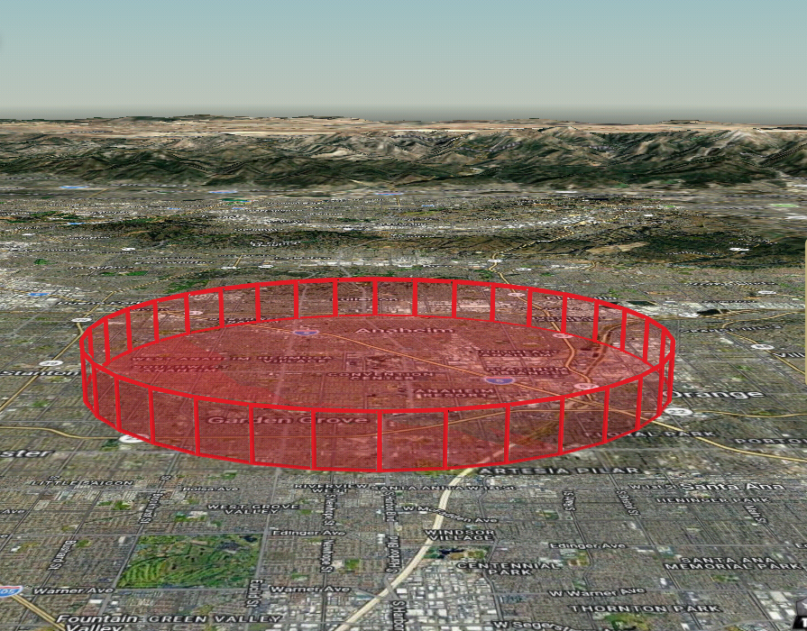

**Red** is in effect now. **Amber** is scheduled and not yet active, so a
restriction that starts this afternoon is visible this morning and reads
differently from one you are already inside.

Some restrictions are published with no shape at all, as a reference to other
airspace. There is nothing to draw for those, and the pane says so rather than
leaving them out.

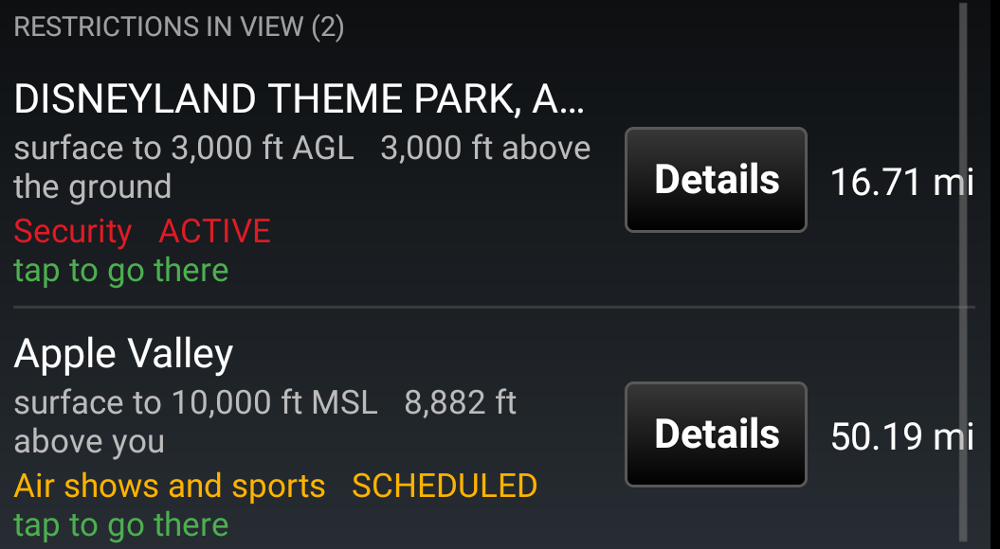

Under the layers is the list of what is on the map. The list and the map follow
one rule: if a restriction is not on the map it is not in the list, and the
status line says why — the zoom gate, the type filter, or that nothing has
reached the phone for this area yet.

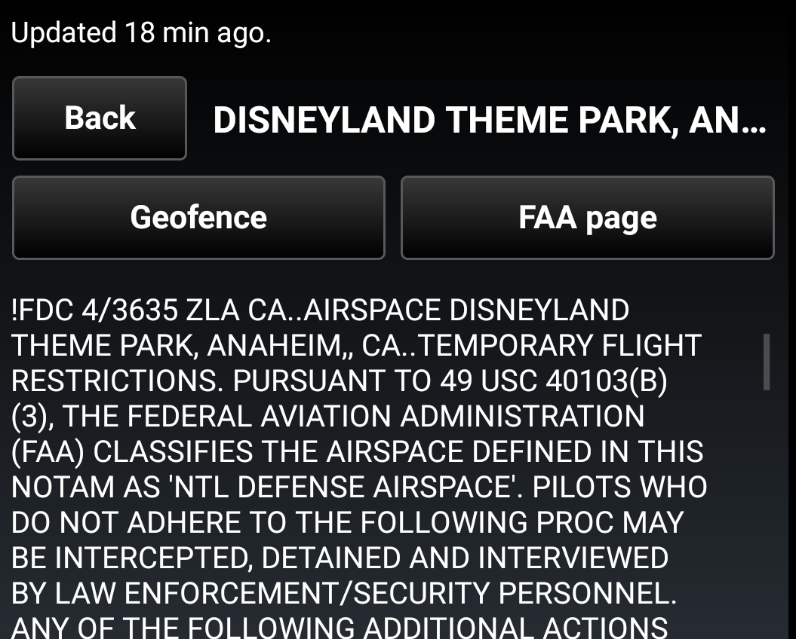

Tap a row, or tap the shape on the map, for the restriction's own page: what it
is, where, the floor and ceiling, when it runs, and the full text as the FAA
wrote it.

- **FAA page** opens the official notice in a browser.
- **Geofence** puts an ATAK geofence on the restriction, so you are warned when
  you cross it. Geofences you have made are listed under Settings, and the pane
  tells you when one no longer matches a live restriction.

---

## Geofencing a restriction

<!-- PICTURE: 37_geofence_dialog.png -->

**Geofence** on a restriction's details page makes a shape you own from its
outline and opens ATAK's own geofence settings for it, so you are warned when
you cross it. A restriction with more than one area asks which one first.

Choose the published limits so it only alerts on something actually inside the
airspace, or ground only if you want it whatever the altitude.

> **It is a copy taken at that moment.** If the restriction moves or is lifted,
> the geofence stays as it is until you remove it.

<!-- PICTURE: 38_geofence_on_map.png -->

The shape sits on the map over the restriction it came from.

<!-- PICTURE: 39_geofences_fold.png -->

**Geofences** under Settings lists what you have made and says whether each
still matches a live restriction, with a way to remove one that does not.

---

## Airspace

Class A through G, drawn one shelf at a time.

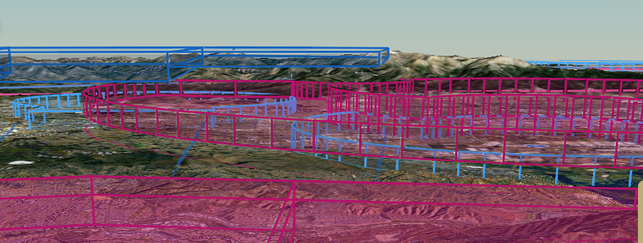

The FAA publishes a Class B airport as a stack of rings, each starting and
ending at a different altitude. AirAware draws each of those steps as its own
volume, so the upside-down wedding cake is the shape it really is rather than
one ring with a note.

With **3D** on, each shelf stands between its own floor and ceiling. Tilt the
map to see it. Airspace that goes up with no published ceiling is drawn so it
does not swallow everything below it.

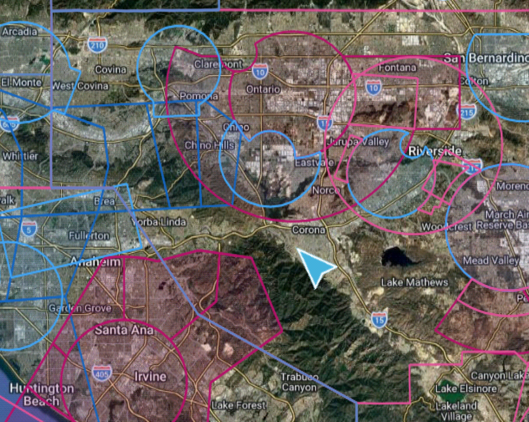

The colors are the sectional chart's: **blue** for Class B and D, **magenta**
for Class C and E. Class E takes its color from how low it comes down, so Class
E starting at 1,200 ft above the ground reads differently from Class E at
700 ft.

**Classes** picks which ones draw. On a busy map, turning off the class you are
not working under is the fastest way to see what matters. **Names on the map**
puts each shelf's name and heights beside it.

---

## Special Use airspace

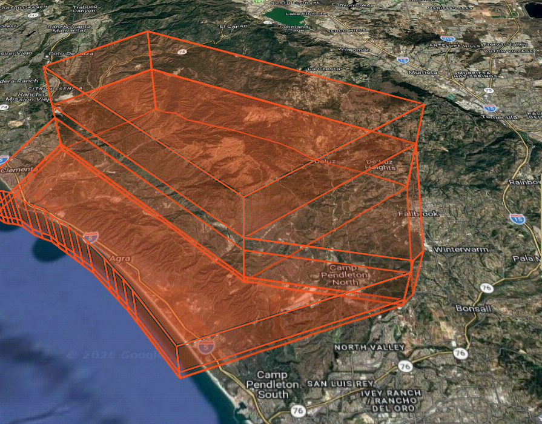

Prohibited, Restricted, Warning and Alert areas, and Military Operations Areas.
**Kinds** picks which of those draw.

Each area's page says whether it is continuous or activated by NOTAM. An area
that is only active when a NOTAM says so is still drawn, because you need to
know it is there before you go looking for the NOTAM.

---

## UAS ceilings

How high a drone may fly without an authorization, from the FAA's UAS Facility
Map.

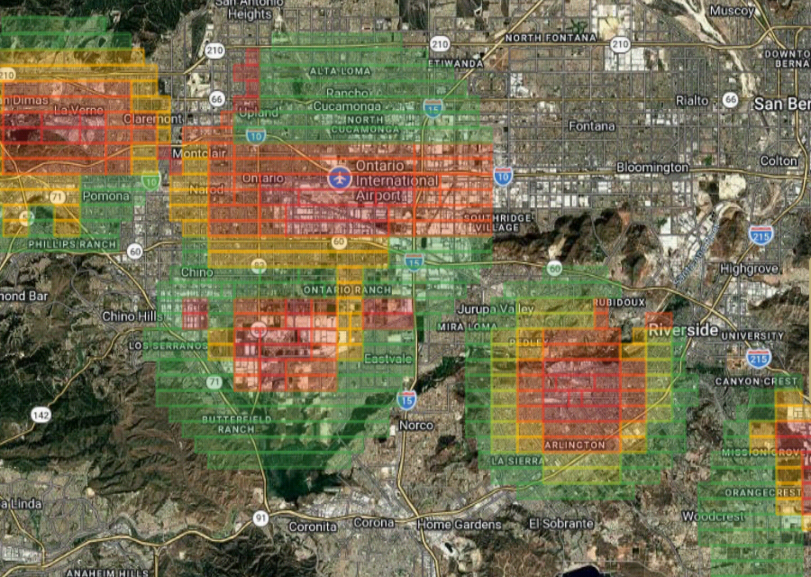

A grid of squares colored by their ceiling: **green** where you have the full
height, through to **red** where you have very little. A **0 ft** square is
drawn hardest of all, because it is the one that means you cannot fly there
without coordinating first.

The grid is flat on purpose. It is a rule about the ground under you, not a
volume in the air.

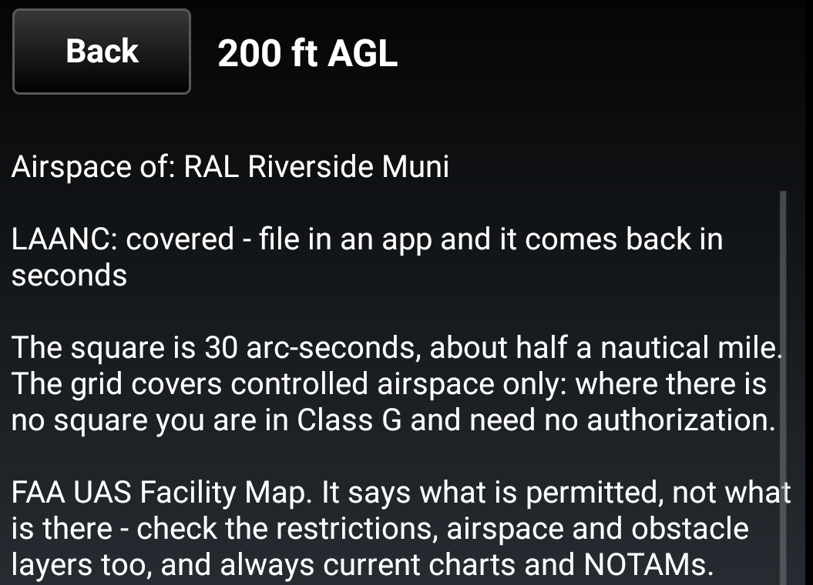

Tap a square for its own page: the ceiling in feet above the ground, the
airport the square belongs to, and whether that airport is covered by LAANC.
That last line is the difference between filing in an app and filing for
further coordination.

These are the heights an authorization is granted against. They are not a
clearance by themselves.

---

## Obstacles

The FAA's Digital Obstacle File: towers, wire spans, transmission lines,
turbines and stacks.

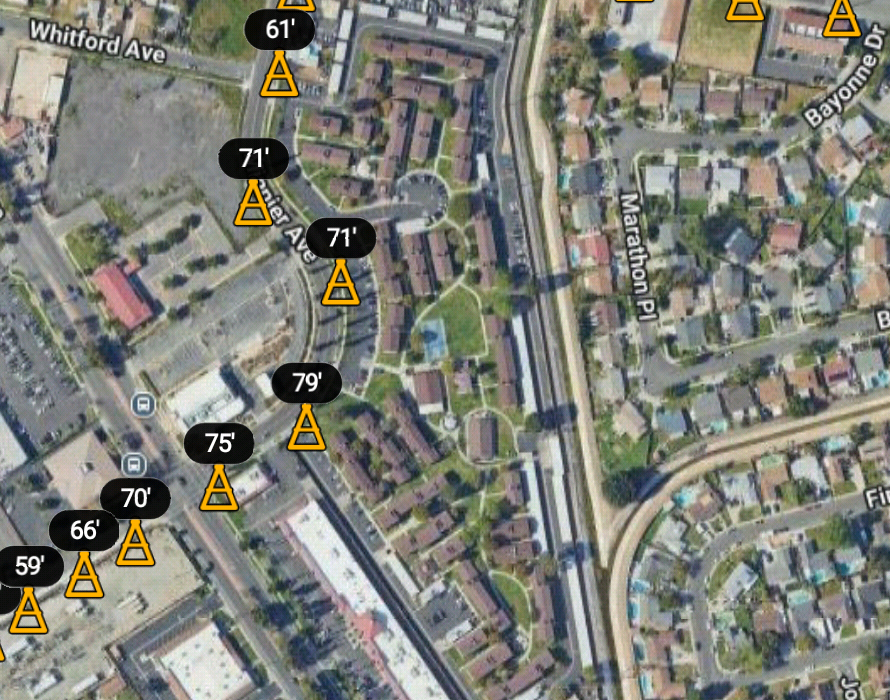

Each obstacle stands from the ground to its published top, with the tower
symbol at the top and its height on a label above that. The label is height
**above the ground**, because that is the number somebody flying low compares
against their own height above the ground.

**Taller than** and **Kinds** keep the map readable. Over a city the file holds
thousands, so the plugin draws the ones nearest what you are looking at and
says in words when it has trimmed the rest.

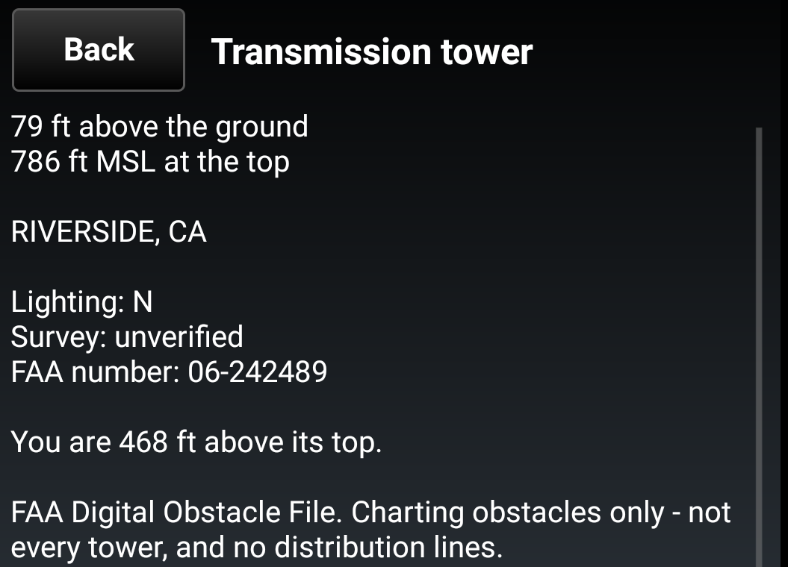

Tap an obstacle for its page: height above the ground and its top above sea
level, its lighting, whether the FAA has verified the position, how many there
are at that point, and the nearest town.

> Not every wire or tower is charted. The FAA's file holds the obstacles that
> affect charting; distribution lines are never in it. Treat an empty map as an
> absence of records, not an absence of wire.

---

## METARs

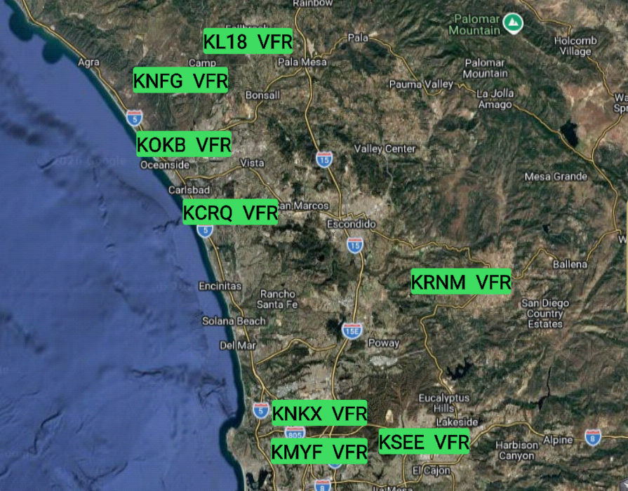

METAR observations drawn as flight-category chips in the aviation convention:
**green** VFR, **blue** MVFR, **red** IFR, **magenta** LIFR.

The category is the one published with the observation. It is never worked out
here from the numbers, so what you see is what the station reported.

Tap a chip for the observation itself and the time it was made. These are the
one thing AirAware does not keep: an old observation is worse than none, so
conditions are shown only while they are current.

---

## Settings

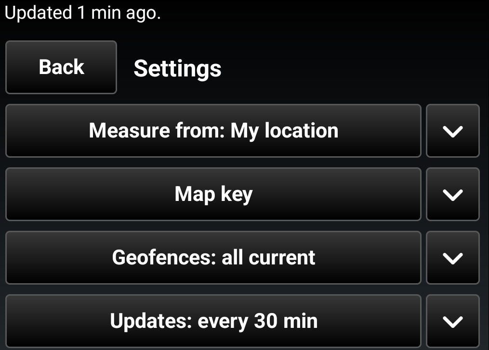

Everything set once and left, on folds that stay as you leave them:

- **Measure from** decides what distances are measured from.
- **Map key** names every color on the map.
- **Geofences** lists the ones you have made, and offers to remove a geofence
  whose restriction is no longer live.
- **Updates** is how often restrictions and airfield conditions are asked for
  again.

At the bottom, a line saying what this phone has already downloaded.

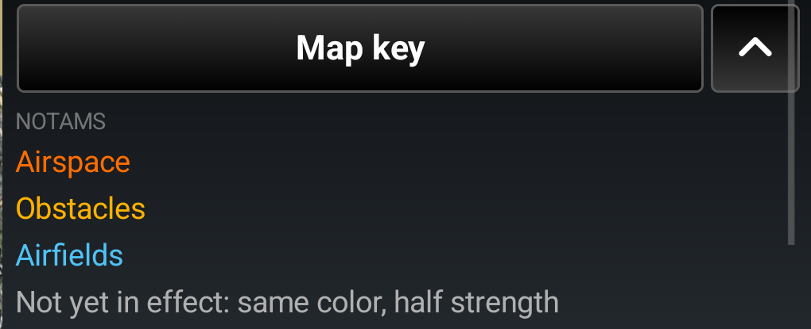

The map key follows the same rule as the list and the map: if a layer is off,
its colors are not in the key.

---

## UAS Flight Plan

The planner is its own screen, reached from **UAS Flight Plan** on the front
page. It answers two questions a UAS pilot has at the turnout before the radio
call to Air Attack: **what ceiling does this mission area need**, and **what
does the ceiling I was given do to it**.

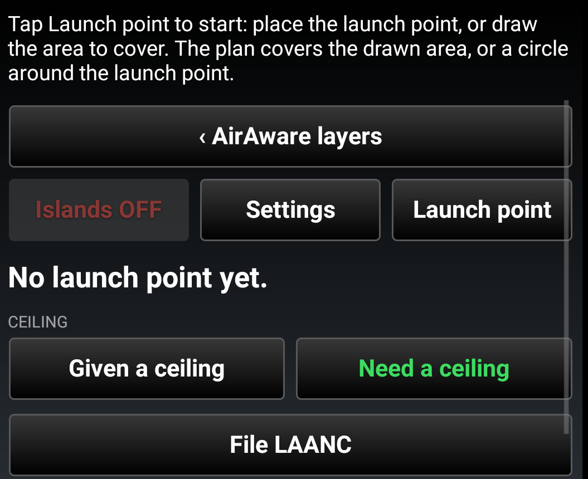

At the top, **‹ AirAware layers** goes back to the layer switches. Under it the
status line, then **Islands ON/OFF**, **Settings** and **Launch point**, and at
the bottom **File LAANC** and **Notify Flight Service**.

### The launch point

Tap **Launch point**. **My position** uses your own GPS fix; **Tap the map**
lets you place it anywhere. **Draw the area to cover** starts the area instead.

The plan covers the drawn area if there is one, otherwise a circle around the
launch point. Everything you set here comes back when ATAK restarts, with no
network.

With no drawn area, the plan is a circle around the launch point; set its size
under Settings. The circle is what the terrain and obstacles are read for, so a
bigger circle is a higher ceiling and a longer read.

### Drawing the area to cover

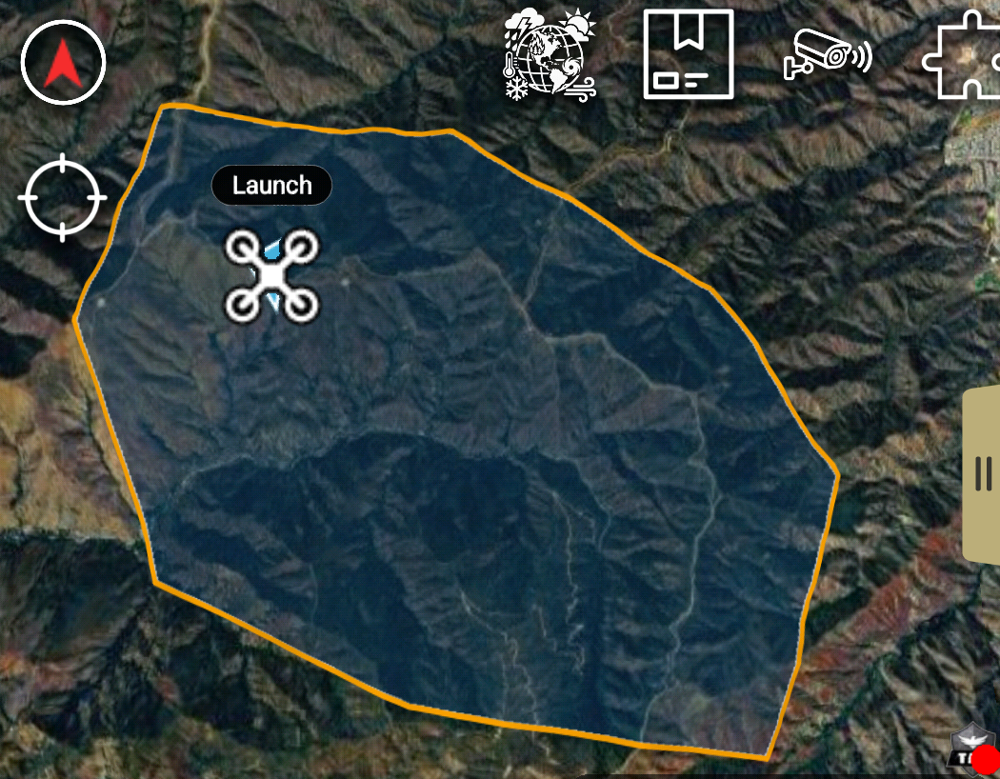

**Draw the area to cover** hands you ATAK's own drawing tools. Tap the map to
place each corner, then tap the first marker to close the shape. Undo and End
Shape are on ATAK's drawing toolbar.

The plan then covers exactly that shape rather than a circle, which matters
when the mission is a strip along a ridge.

### Need a ceiling

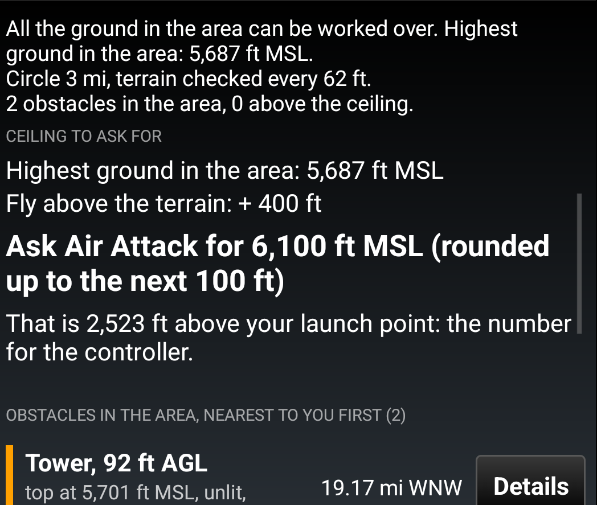

You are planning and have to ask Air Attack for a ceiling. The block reads the
highest ground in the area, adds the height you fly above the terrain
(Settings, Height above terrain), and rounds up to the next 100 ft. The last
line is the same number above your launch point, which is what the controller
wants.

### Given a ceiling

Air Attack assigned you a ceiling and you have to live with it. Tap **Given a
ceiling** and type it. The block reads what that ceiling does to your area: the
highest ground you can work over at your height above terrain, and how much of
the area is too high.

The mission area has to be blue, or the ceiling is wrong for the mission.

### Islands

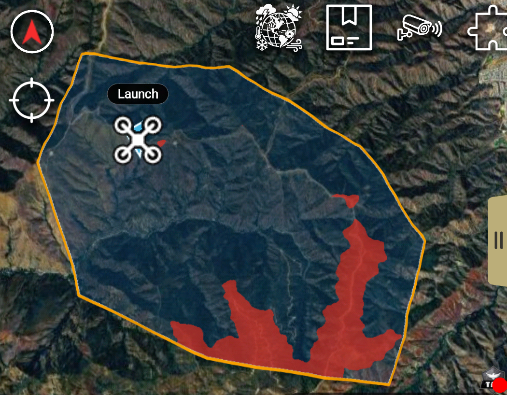

Red islands are the ground you cannot work over at your height above the
terrain. Blue is ground under the ceiling. The edge of the painted area is the
edge of what was checked, not a boundary in the world.

### Obstacles in the plan

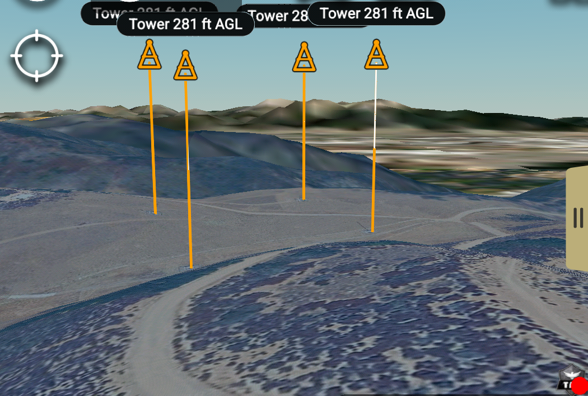

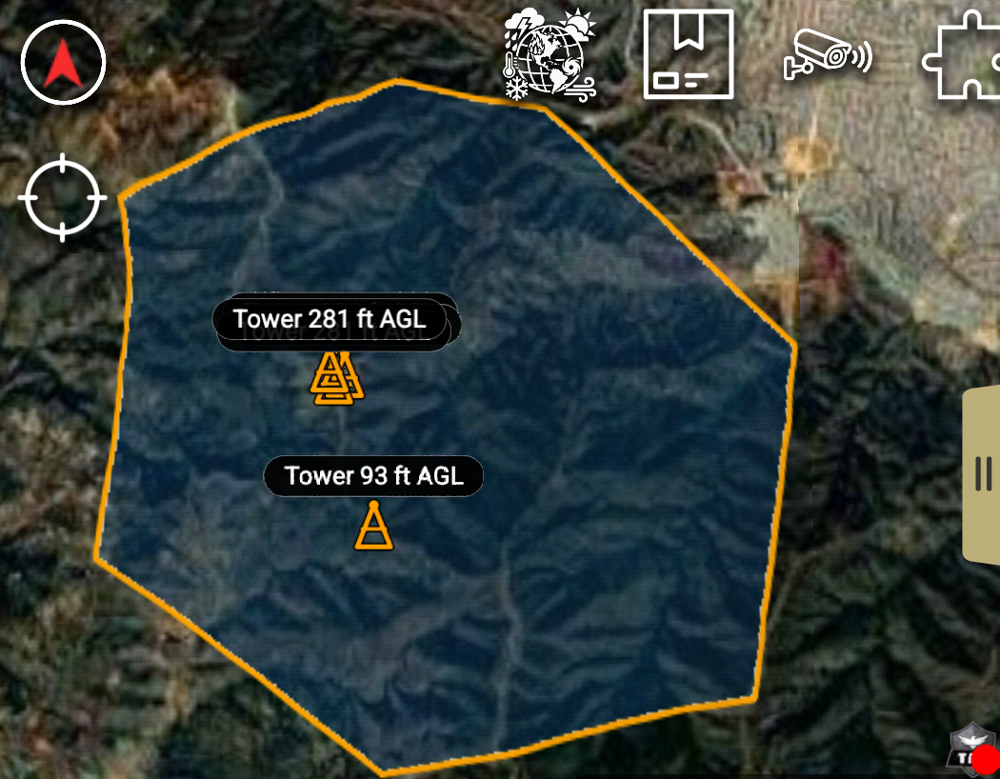

The planner draws the charted obstacles inside the plan area and says how many
are above your ceiling. These come from the same FAA file as the Obstacles
layer, read from what the phone already holds, so the planner works with no
signal.

Under the readouts, the obstacles in the area, nearest first, each with its
height, its top above sea level, its lighting and how far away it is.

**Details** opens one obstacle: its heights, whether its top is above or under
your ceiling, and the distance and bearing from the launch point.

### Planner settings

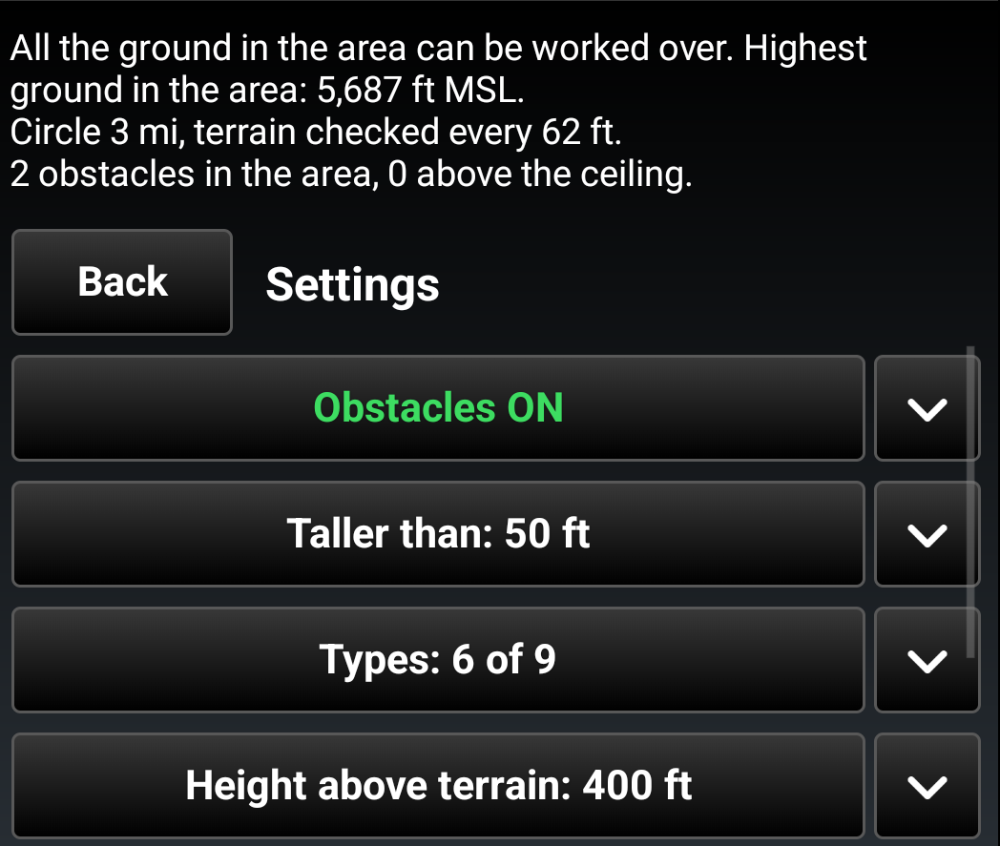

**Back** returns to the plan. Here are the obstacle switch, **Taller than**,
**Types**, the **Height above terrain** you fly at, the separation, and the
size of the circle.

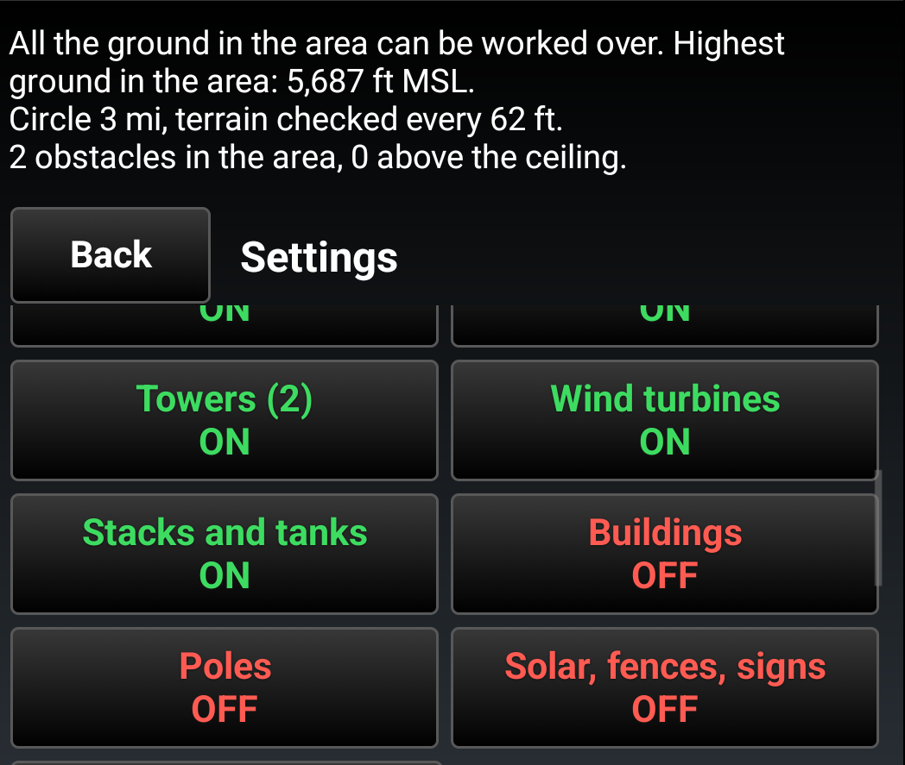

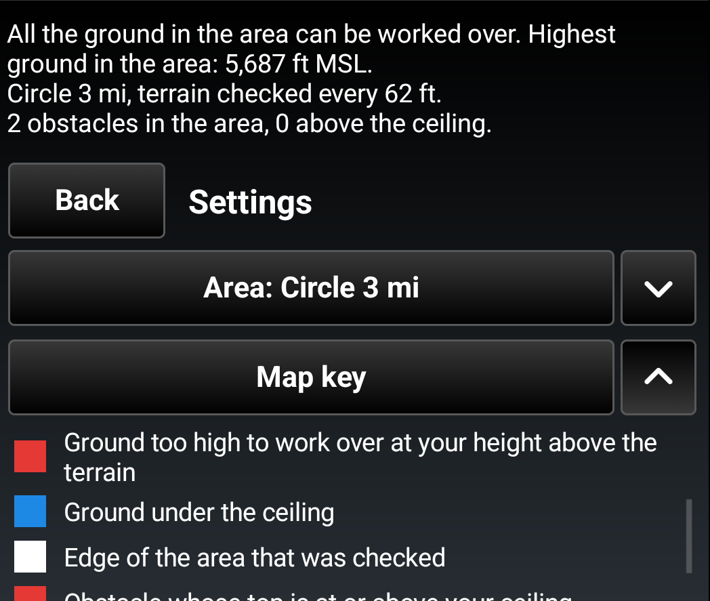

**Types** picks which kinds of obstacle are drawn and listed. **Map key** names
every color the planner puts on the map.

### When there is no terrain data

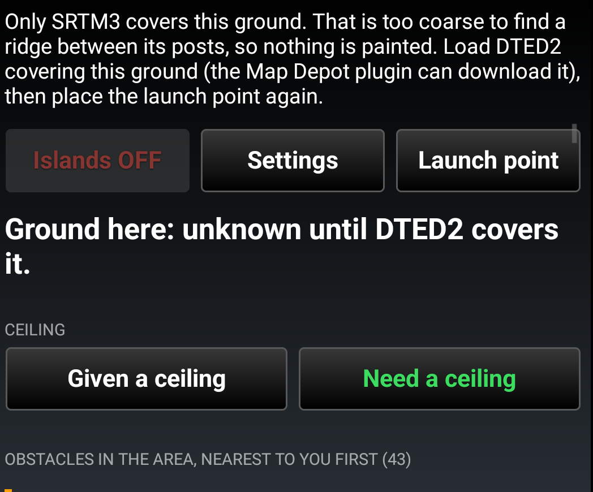

The planner reads the elevation ATAK carries. Where it is missing, the plugin
says so and leaves that ground unpainted rather than computing a ceiling from
data it does not have. Load the elevation for the area and the readouts fill
in.

### When there is no network

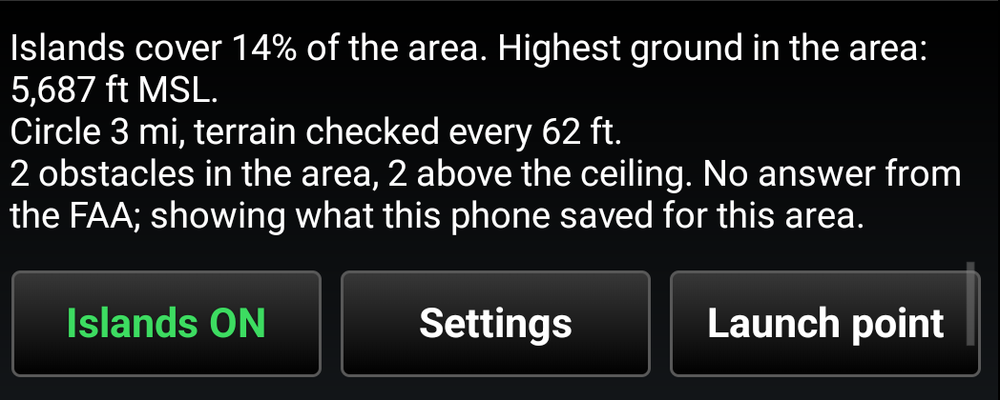

The status line says what you are looking at in words, and names what it could
not reach. A failed fetch never empties the map.

---

## Filing an authorization

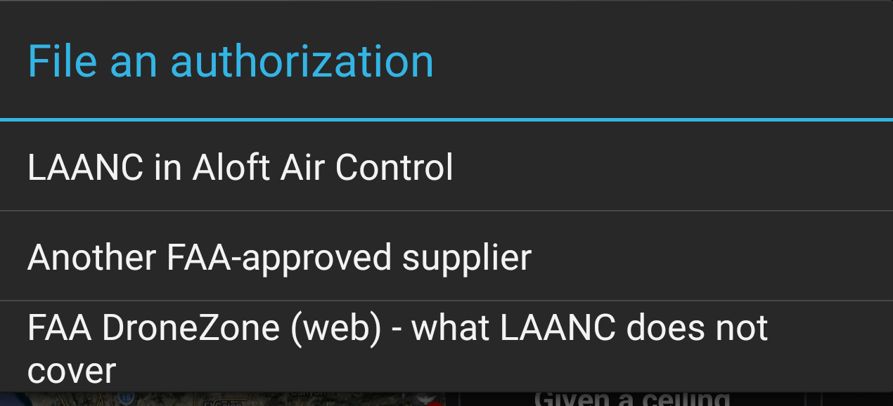

**File LAANC** asks which way you are filing and takes you there.

LAANC is granted through FAA-approved suppliers, not by the FAA directly, so
the button opens the supplier's app if you have it and its website if you do
not. Anything LAANC does not cover goes through FAA DroneZone instead, which is
the second choice on the dialog.

AirAware does not file anything for you and does not send it your plan. It
takes you to the form.

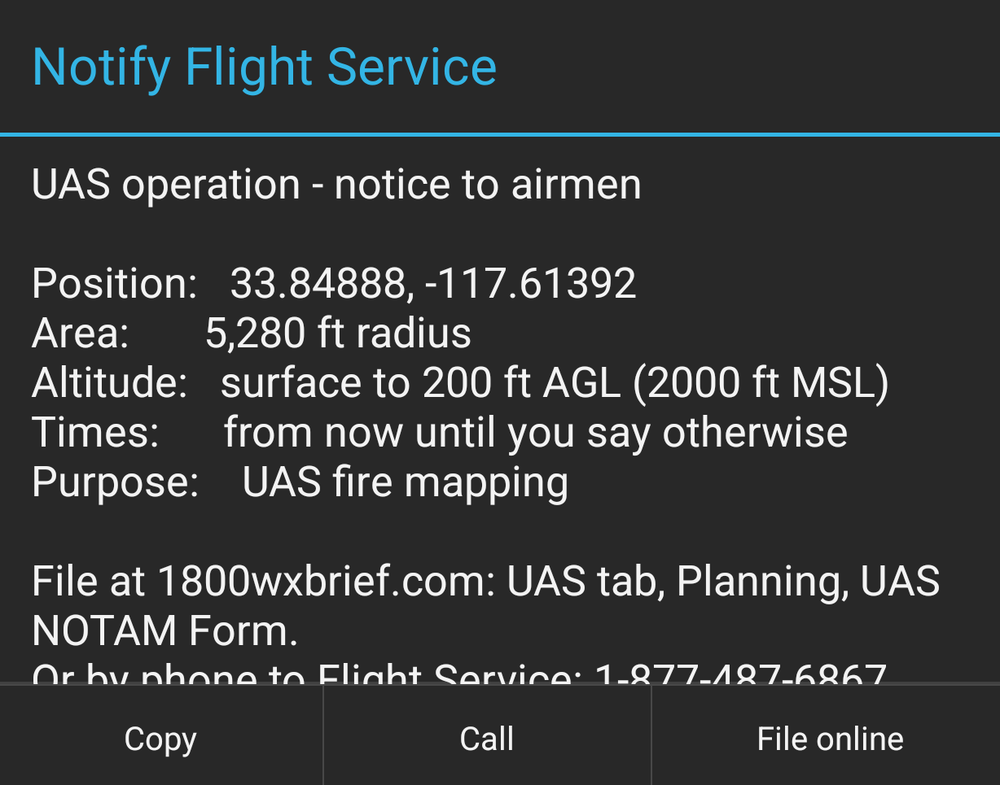

**Notify Flight Service** gathers the plan's own numbers, ready to read out or
paste: where you are launching, the area, the ceiling, and when. Nothing is
transmitted. You place the call or open the form.

---

## This guide inside the plugin

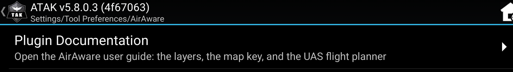

The same guide is built into the plugin as a PDF. Open it from **Settings**,
then **Tool Preferences**, then **AirAware**, then **Plugin Documentation**.

---

## Worth knowing

- **Advisory only.** Everything AirAware draws is a picture of published data
  at the time it reached this phone. It is not a clearance, it is not current
  by itself, and it does not replace charts, NOTAMs or a call.
- **Nothing is shared.** No TAK Server, no Data Sync, no CoT. What you switch
  on is on your device only, and your position is never sent anywhere.
- **What it holds, it keeps.** Airspace, restrictions, obstacles and UAS
  ceilings that have reached this phone come back after a restart with no
  network. METARs do not, on purpose.
- **It says what it is not showing.** A trimmed list, a layer under its zoom
  gate or an area that was never downloaded is stated in words on the status
  line. A quiet map is not the same as an empty sky.

---

## Problems

Open an issue at https://github.com/takwerx/air-aware/issues

---

Data published by the Federal Aviation Administration. Use of FAA data does not
imply FAA endorsement.

AirAware is free software under the AGPL-3.0-or-later with an additional
permission for the TAK Software. See [LICENSE](../LICENSE) and
[LICENSE-EXCEPTION.md](../LICENSE-EXCEPTION.md).
