# Cam Depot for ATAK — User Guide

**Version 0.9 · takwerx**

**Download Cam Depot 0.9** (pick the one matching your ATAK-CIV version, sideload, then load it in ATAK's Plugins manager):

- **ATAK-CIV 5.6:** https://github.com/takwerx/cam-depot/releases/download/v0.9/ATAK-Plugin-CamDepot-0.9--5.6.0-civ-release.apk
- **ATAK-CIV 5.7:** https://github.com/takwerx/cam-depot/releases/download/v0.9/ATAK-Plugin-CamDepot-0.9--5.7.0-civ-release.apk
- **ATAK-CIV 5.8:** https://github.com/takwerx/cam-depot/releases/download/v0.9/ATAK-Plugin-CamDepot-0.9--5.8.0-civ-release.apk

All releases: https://github.com/takwerx/cam-depot/releases

Cam Depot puts public traffic and wildfire cameras on the ATAK map — roughly
38,000 of them across 54 states and provinces, from state departments of
transportation, the FAA, and the wildfire lookout networks. You pick an area,
filter down to what you want, and bring it in. Tap a camera for its latest
picture; where the agency publishes a stream, play it as live video inside ATAK.

---

## Before you start

Published builds exist for **ATAK-CIV 5.6, 5.7 and 5.8**. Plugins are matched to
the ATAK release they were built against, so download the one for the ATAK
version on your device — a mismatch will not load, and the failure does not look
like a version problem.

Cam Depot needs outbound HTTPS for the catalog, and whatever port the agency
serves its own pictures and video on. No account, no key, no configuration, and
no TAK server involvement. It does not read or transmit your position, callsign,
or any other ATAK data.

---

## 1. Opening it

Load the plugin from ATAK's Plugins manager, then open it from the toolbar. The
icon sits with the other tools, and tapping it again closes the panel.

The first thing it does is load the catalog, then the cameras for the state it is
showing. A line at the top of the panel says so while it works.

---

## 2. Finding cameras

The panel is the control. The map shows exactly what the panel selects, never the
whole catalog.

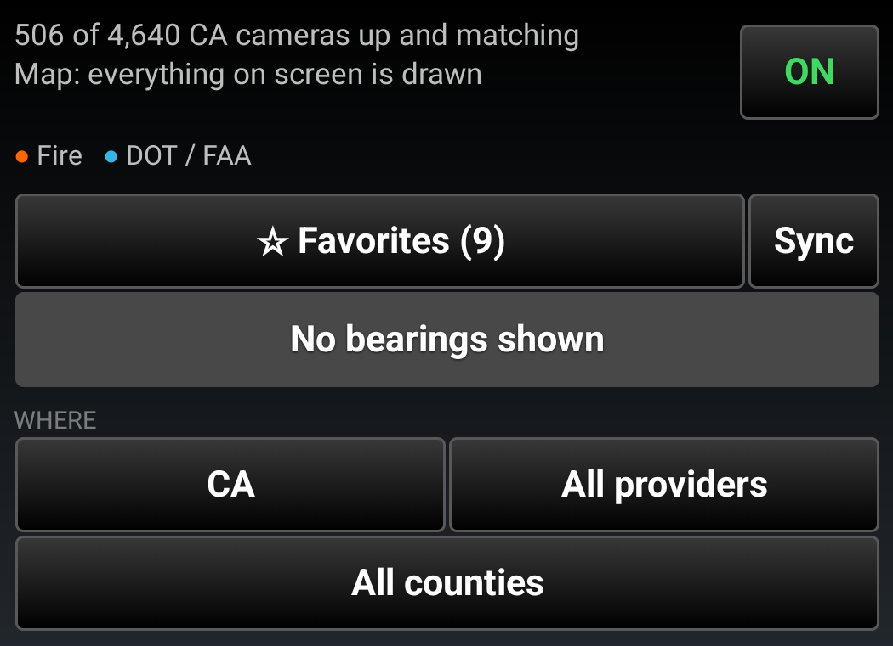

- **State** — the state or province, 54 of them.
- **Provider** — one agency within it.
- **County** — as many counties as the job covers.
- **On screen only** — just what is in the current map view.

### State and provider

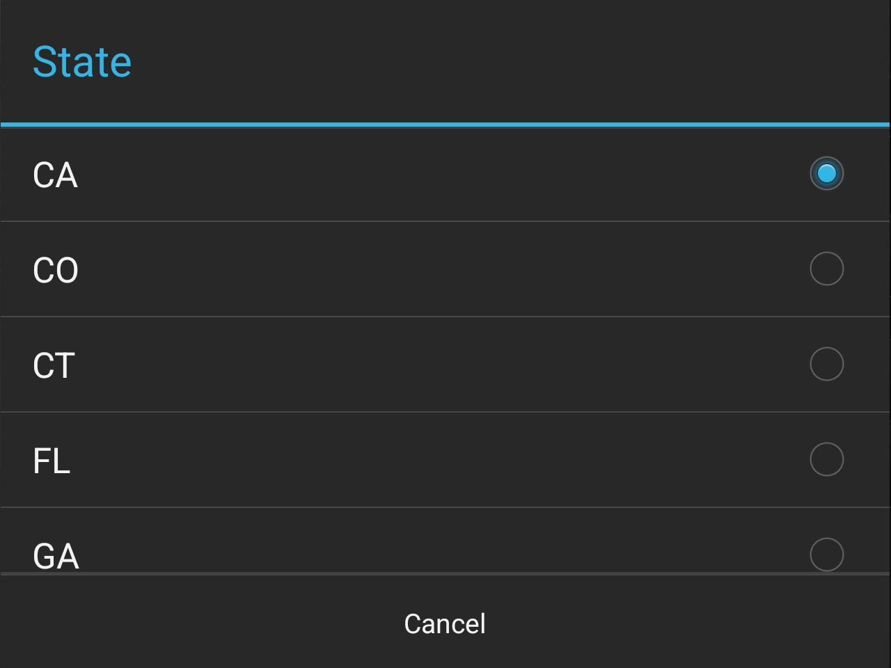

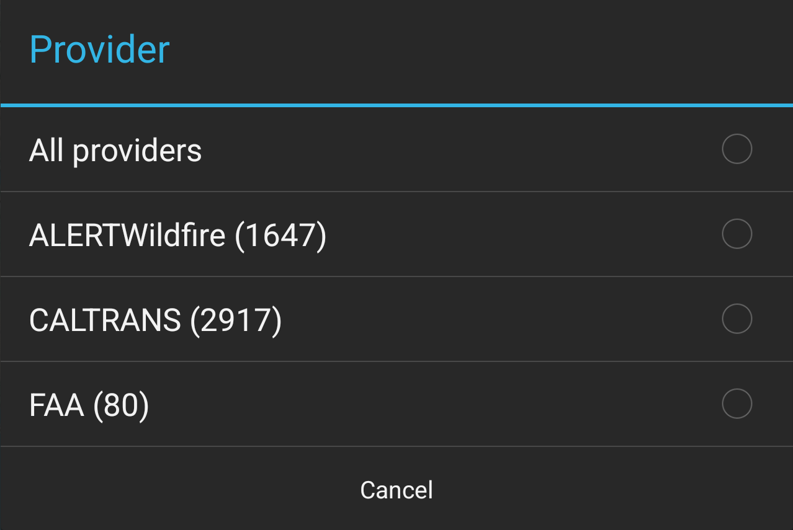

Every agency says how many cameras it has **before** you pick it, so you can see
what a filter will cost rather than toggling it and watching a total move.

### Counties, several at a time

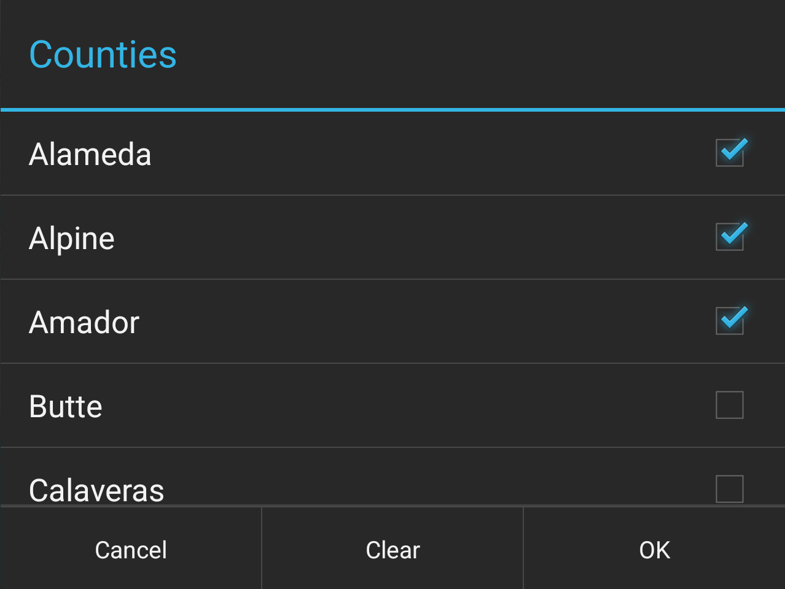

Counties tick on and off — pick as many as you need. They come from Census
boundaries rather than from the camera feeds, so they work on every camera in the
United States, not only the ones whose agency happened to publish a county.

Afterwards the button counts what you picked and the line above counts what is
left:

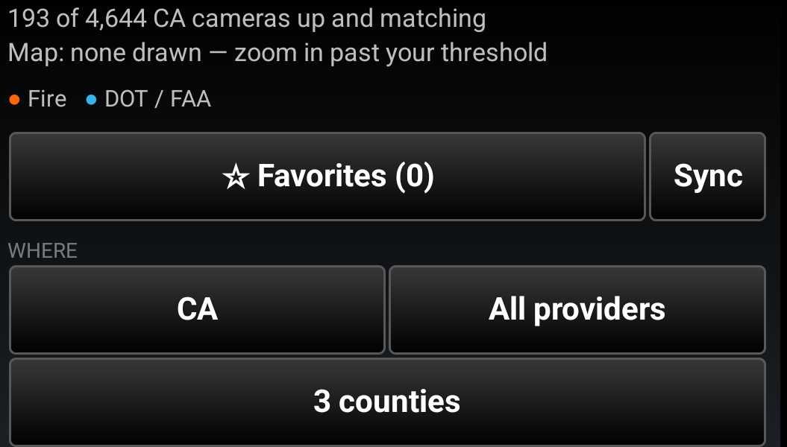

### On screen only

**On screen only** limits the list to the cameras inside the current map view,
and keeps following as you pan and zoom. Move the map and the list moves with it.

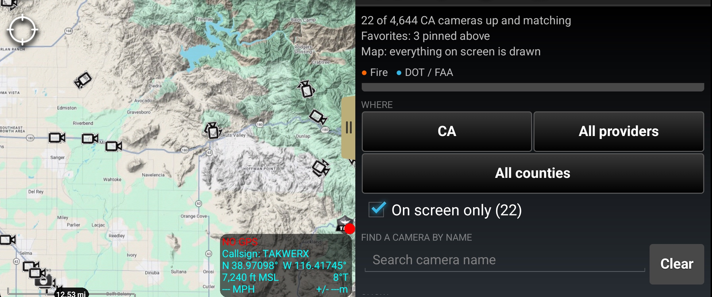

The count on the control, the count in the status line and what is drawn on the
map are the same number. This is the fastest way to answer "what is near this
spot" — put the spot on screen, and the panel is already the answer. It follows
the map rather than your own position, so it works just as well for an area you
are not standing in.

---

## 3. Finding one camera by name

Typing in the search box searches **every state at once**, not only the one in the
dropdown. Here "pitt" finds a wildfire camera in California and three highway
cameras in British Columbia together.

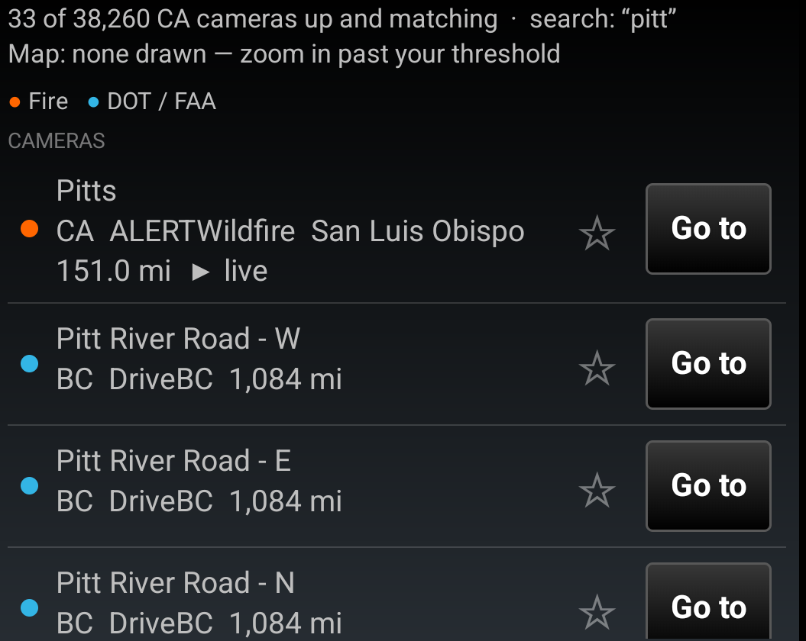

Camera names are the agency's own — "I-40/75 @ West Hills", "Keller Peak 1" — so
a road number, a landmark or a peak name will usually find it.

**Clear** sits beside the box and lights up only while something is in it, so a
live Clear button is the panel telling you a search is still filtering the list.

### Reading a row

Each row is one camera. The colored dot says what kind: **orange** for a wildfire
lookout, **blue** for a department of transportation or FAA camera. Under the
name are the state, the agency, the county and the distance, and a small
▶ **live** marks a camera that streams.

**Go to** moves the map to that camera and zooms in close enough to see the road
it is watching. Tapping the row itself opens the camera.

---

## 4. Narrowing further

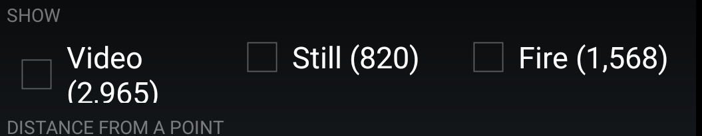

**Video**, **Still** and **Fire** each carry their own count for the state you
are in. A filter with nothing behind it is disabled rather than left to be
discovered.

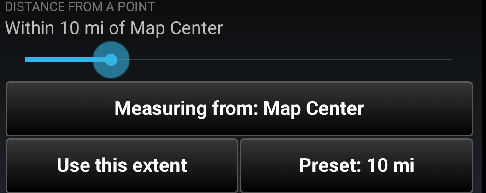

The radius slider limits the list to cameras within a set distance. By default
that is measured from your own position; **From me** switches it to measure from
the center of the map instead, which is what you want when you are planning
somewhere you are not standing. Distances follow whatever units ATAK is set to.

---

## 5. Favorites

The star at the end of each row marks a camera as a favorite. Favorites are kept
on the device and survive restarting ATAK.

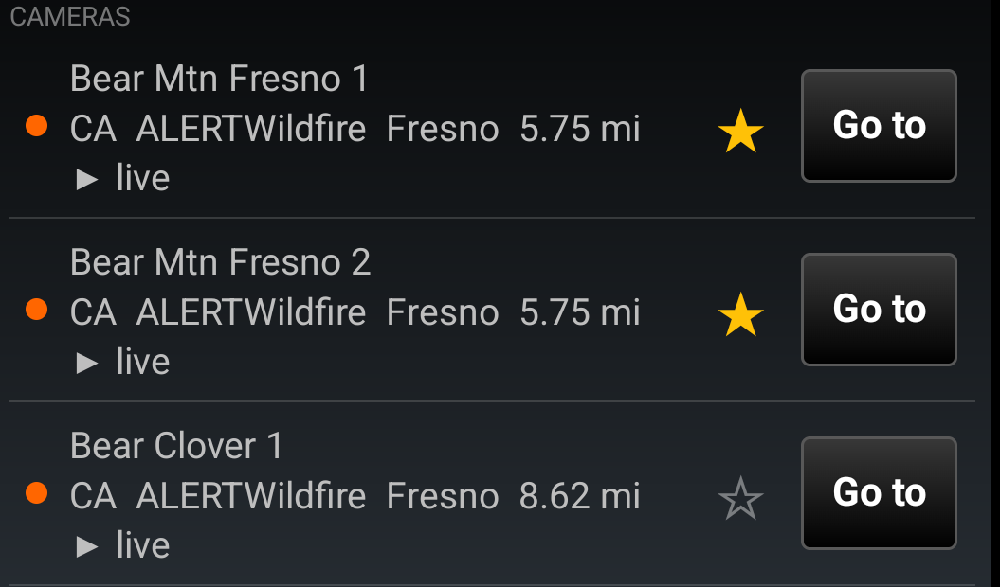

Tapping **Favorites** turns the button gold and pins them:

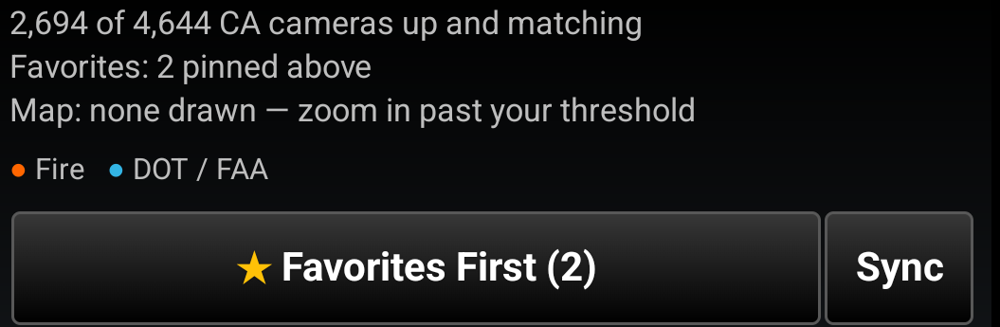

They get their own section, with the whole state still below it:

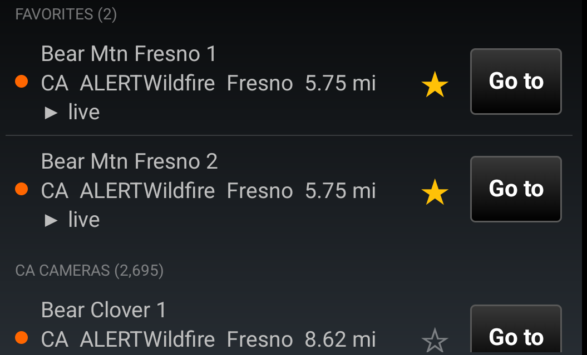

Favorites are not tied to a state. A lookout in California and a highway camera in
Ontario sit in the same list, so the handful you actually watch stays within reach
without giving up the rest of the catalog.

The same star appears in the camera's own pane, so you can mark one while you are
looking at it.

---

## 6. Opening a camera

Tapping a camera, in the list or on the map, opens it in a side pane so the map
stays live behind it.

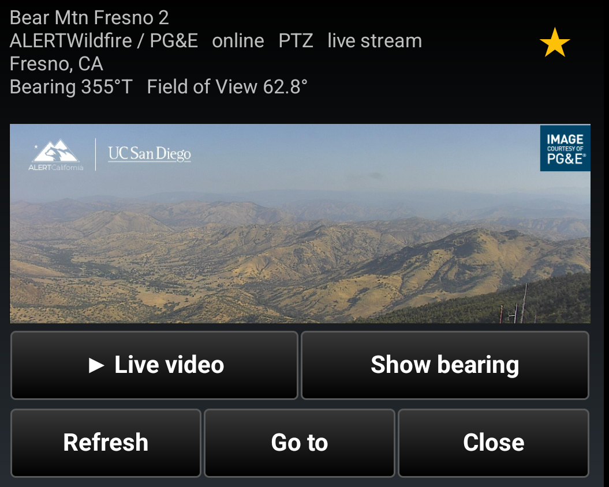

The pane names the camera, then says the agency, whether it is online, whether it
steers, and the county — then shows the latest picture. **Refresh** fetches a new
frame; while one is on its way the pane says *Fetching the latest picture…*
rather than sitting blank, because a slow agency and a broken one look identical
otherwise.

Pictures are current to within about a minute on most networks. Some agencies
publish on their own cycle: British Columbia refreshes its whole province every
few minutes, so a picture there can be a few minutes old even when everything is
working.

A few cameras publish live video and no picture at all — all of Maryland works
this way. Those say so, and point you at the video button.

---

## 7. Live video

Where the agency publishes a stream, **Live video** plays it in ATAK's own player.

Not every camera has one. A camera that only publishes pictures says
**Video (still only)** rather than offering a button that cannot work. Of the
38,000 cameras in the catalog, about 9,000 stream.

Streams are checked before they are published, so a camera that offers video was
serving video when the catalog was built. Agencies do have outages; when one does,
its cameras keep their video button rather than silently losing it, and they come
back when the agency does.

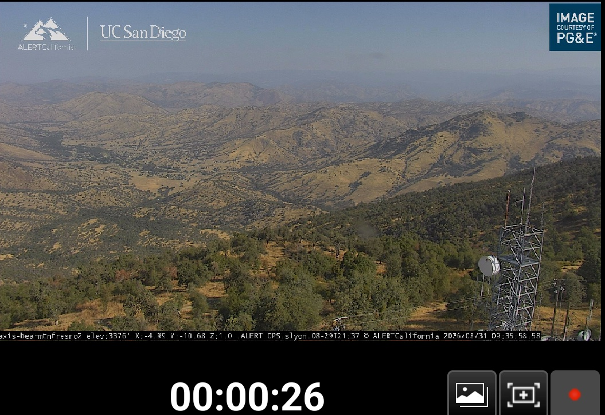

It plays in ATAK's own player, with its snapshot and record controls. The overlay
across the picture is the agency's, not ours.

Closing the video returns you to the map. The toolbar icon reopens the panel.

### Which cameras stream

The map says so before you open anything.

| Streams | Stills only |
|---|---|
| 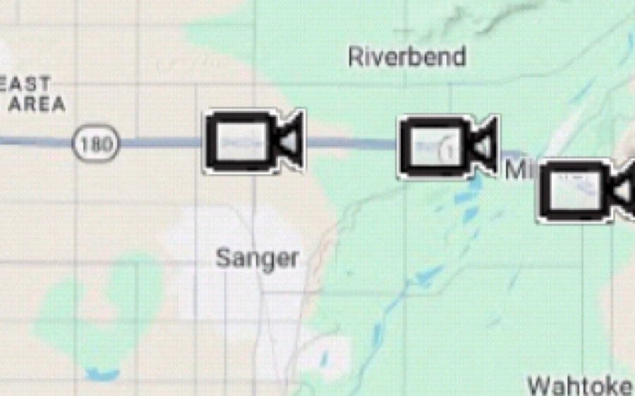 | 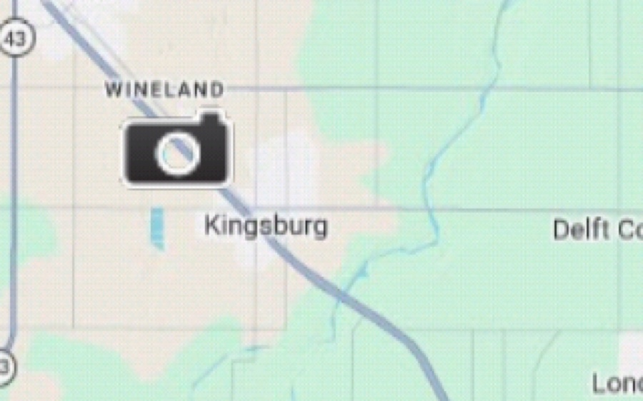 |
| ATAK's own camcorder | A plain camera |

The list says it a second way, with ▶ **live** under the name.

---

## 8. Bearings

Cameras that report which way they are pointing can draw a bearing line on the
map, labeled with its azimuth.

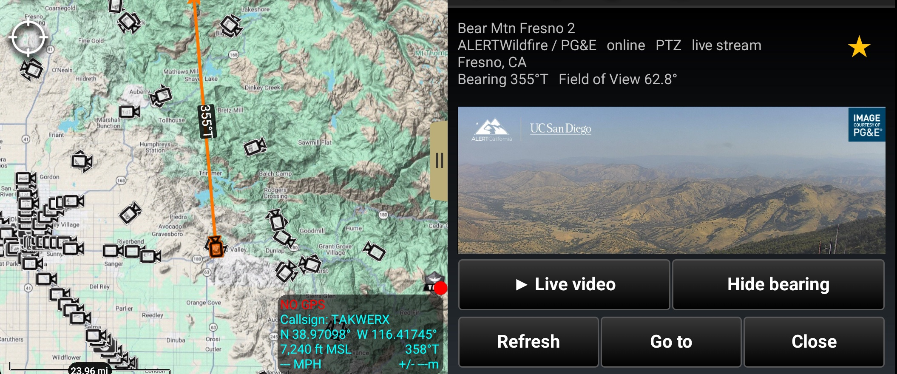

**Show bearing** turns it on, and the marker turns orange while it is on. On a
steerable camera the line follows the camera as it moves, updating every few
seconds.

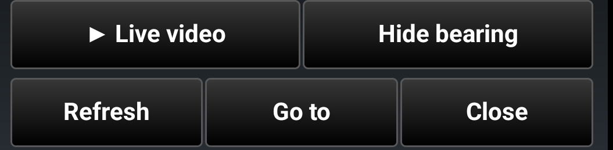

### What the line is, and is not

The line is the **direction** the camera points. It is not how wide it sees.

A camera's pane reports both — **Bearing 355°T   Field of View 62.8°** — but only
the bearing is drawn. A field of view is a wedge, and sixteen hundred overlapping
wedges is a map you cannot read, so Cam Depot draws the direction and leaves the
width as a number.

Opening a stills camera that reports a bearing shows its line automatically for as
long as the picture is open, then puts it away again. A camera that publishes no
bearing says *No bearing reported* rather than drawing a line that would be a
guess.

> On the wildfire networks the bearing runs ahead of the picture. The agency
> reports where a camera is pointing immediately and publishes its image twenty to
> thirty seconds later. The line is the truth; the picture is the recent past.

---

## 9. Drawing on the map

Thirty-eight thousand markers would be unreadable, so Cam Depot draws cameras only
when you are zoomed in past a threshold you choose.

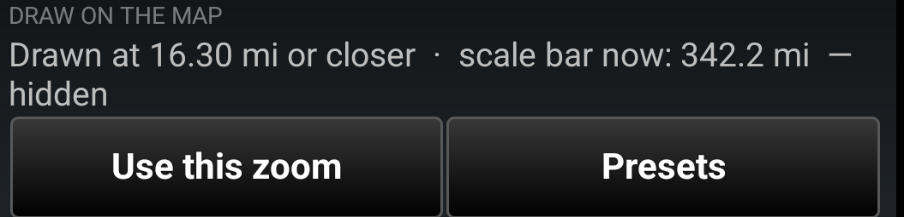

**Use this zoom** takes whatever you are looking at right now and makes it the
threshold — you set it by example rather than by picking a number. **Presets**
offers a few starting points described in plain terms:

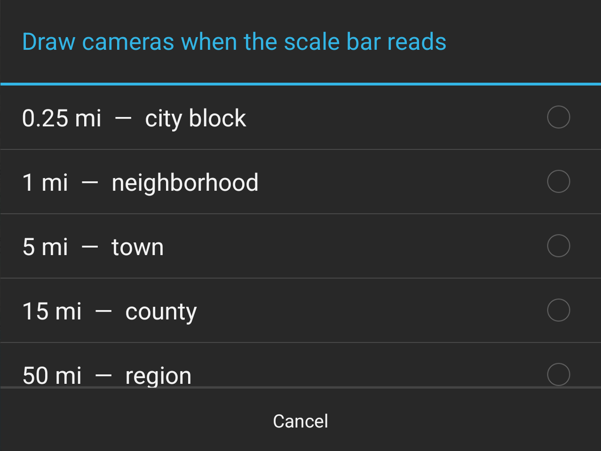

Past the threshold, the cameras draw:

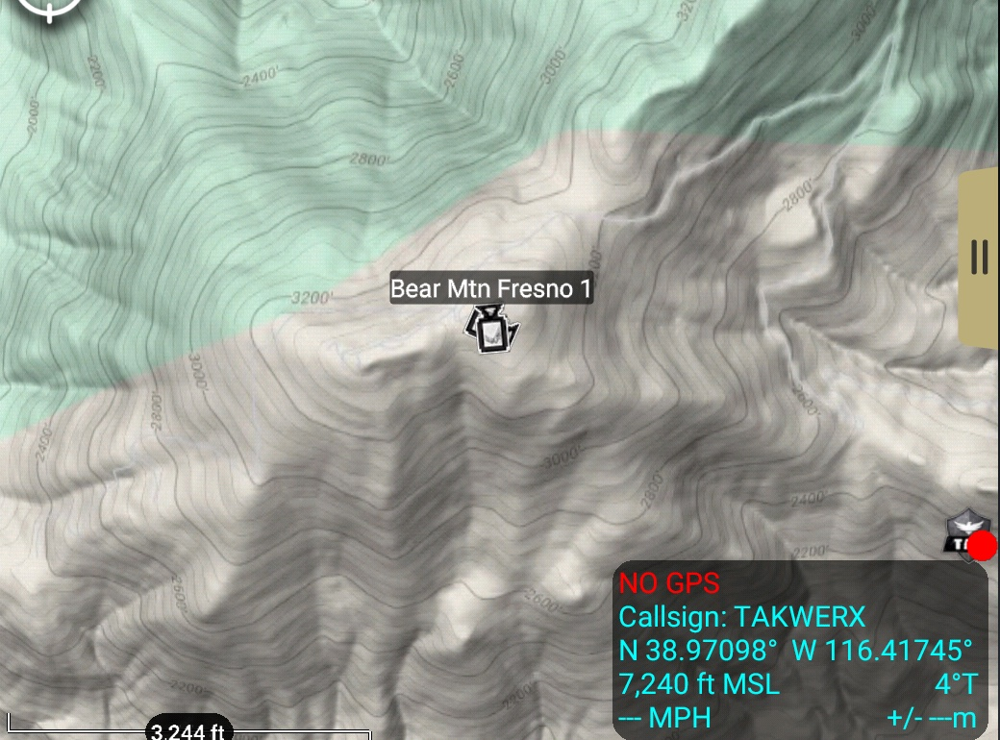

And the panel always says what the map is doing:

If more cameras match than can be drawn legibly, the panel says how many were left
off and to zoom in. It will not quietly show you part of the picture.

---

## 10. Keeping up to date

The catalog changes: agencies are added, cameras come and go, and stream addresses
move. **Sync** re-reads the catalog and reloads the state from scratch, so a
catalog that changed while the plugin was running is picked up without restarting
ATAK.

Use it when a camera you expect is missing, or when video that worked yesterday
does not connect today. It takes a few seconds.

---

## 11. Where the cameras come from

Cam Depot does not talk to twenty agencies from your device. One service collects
from them, checks what it collected, and publishes a single catalog that every
device reads. That keeps a tablet off the hook for a six-megabyte download, and
keeps one polite poller in front of each agency instead of hundreds.

**Camera pictures and video are fetched straight from the agency by your device.**
They do not travel through anything of ours.

The catalog covers the wildfire lookout networks, the FAA weather cameras, and the
departments of transportation of most states and several Canadian provinces.
Coverage grows as agencies are added.

---

## 12. In the plugin

The same guide ships inside the plugin as a PDF, for when you are in the field
without this page. In ATAK go to **Settings → Tool Preferences → Cam Depot →
Plugin Documentation**.

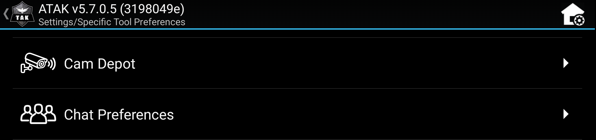

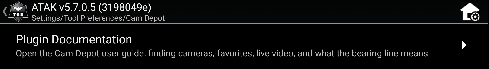

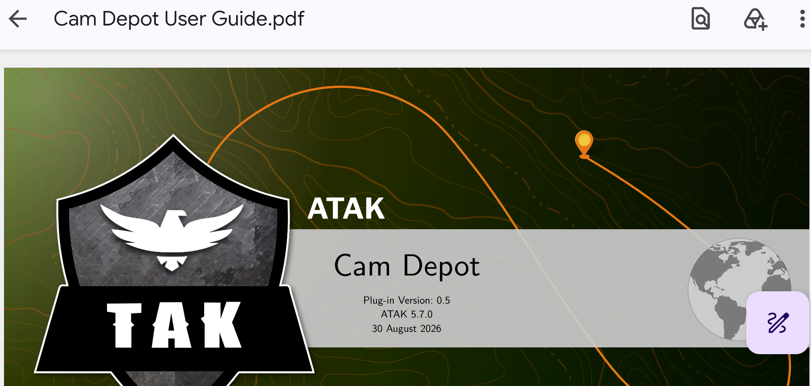

---

## Questions and problems

Issues and questions: https://github.com/takwerx/cam-depot/issues
