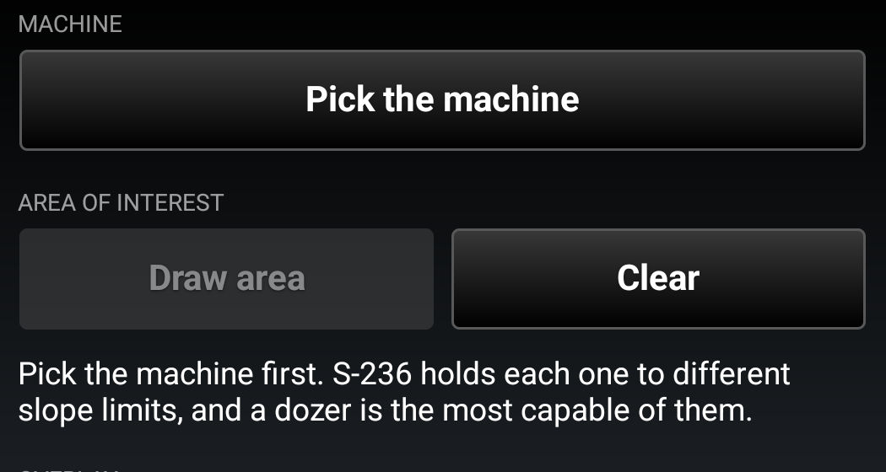
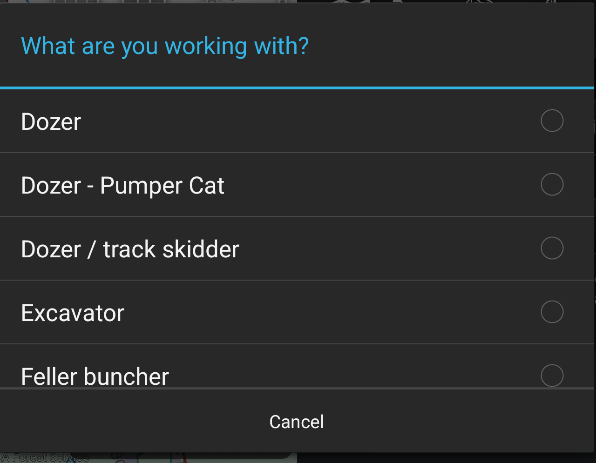
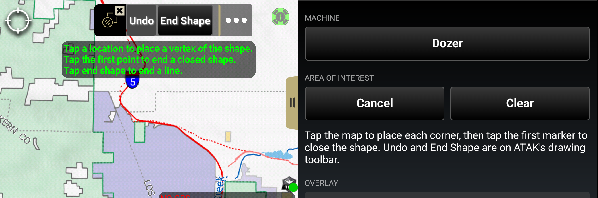
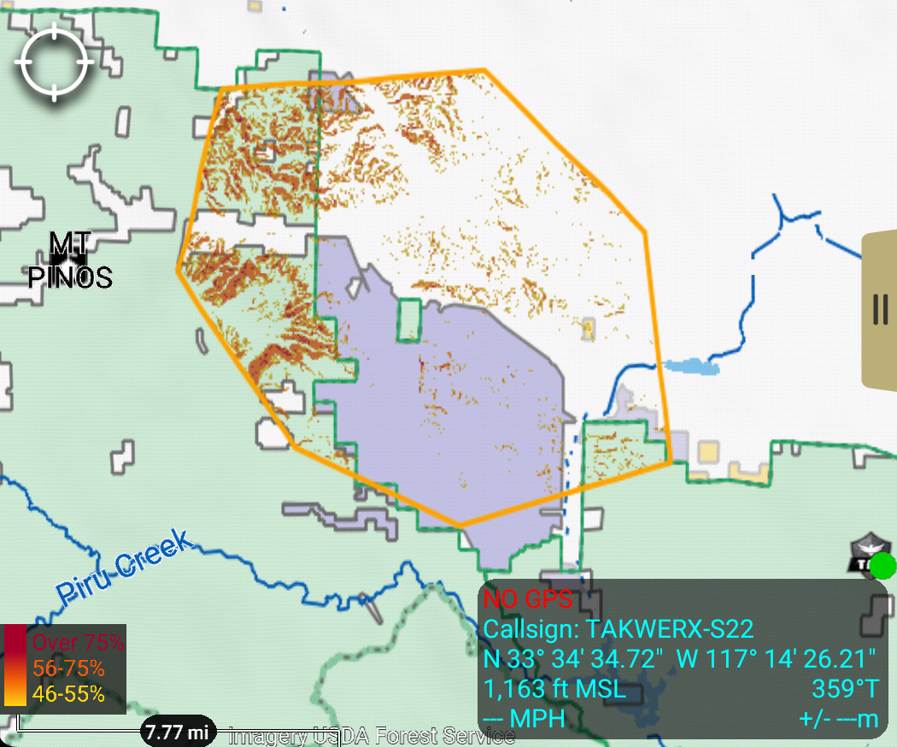
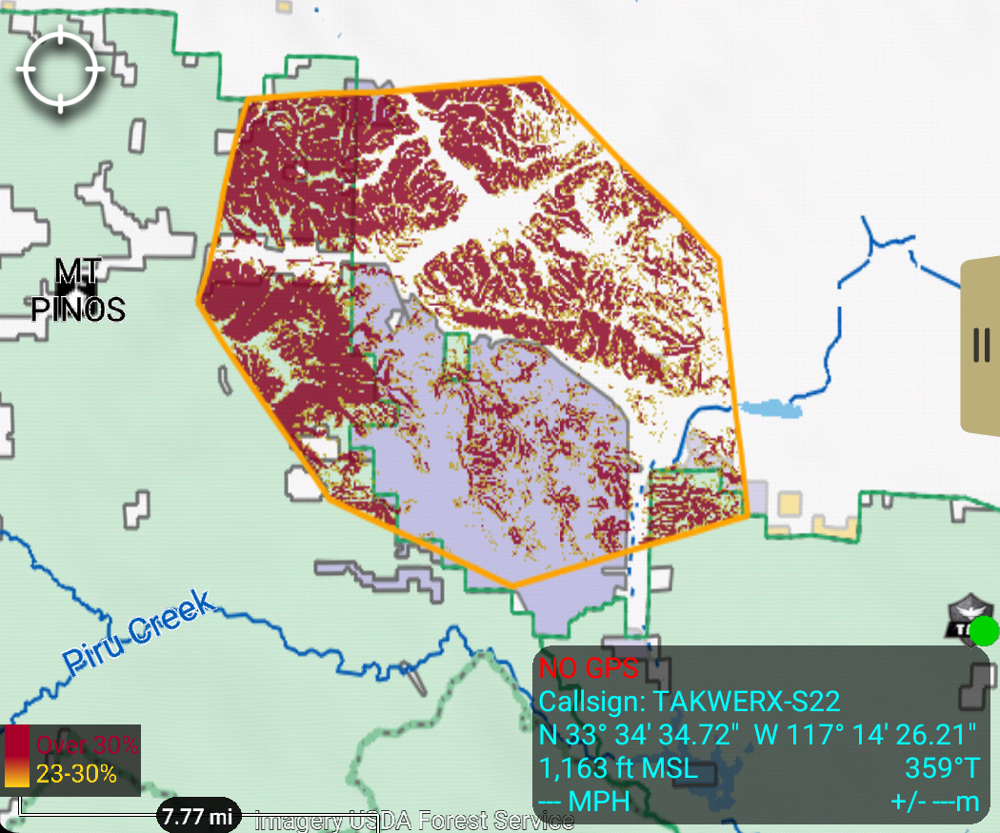
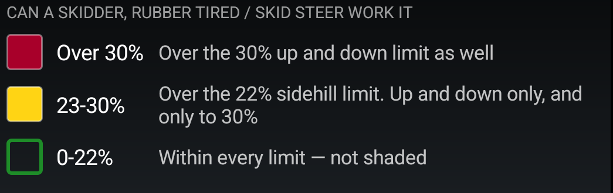
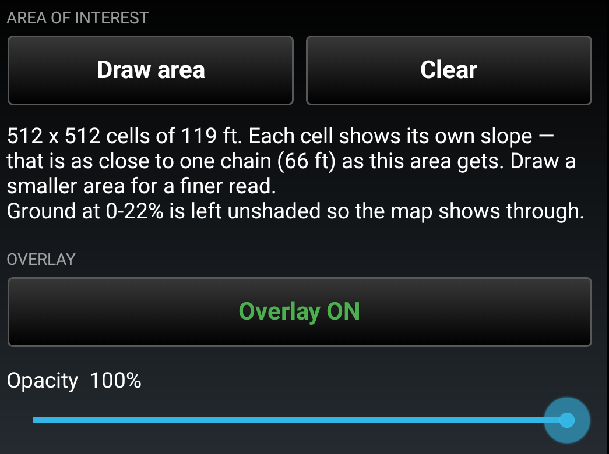

# Dozer Country for ATAK — User Guide

**Version 0.7 · takwerx**

**Download Dozer Country 0.7** (pick the one matching your ATAK-CIV version, sideload, then load it in ATAK's Plugins manager):

- **ATAK-CIV 5.6:** https://github.com/takwerx/dozer-country/releases/download/v0.7/ATAK-Plugin-DozerCountry-0.7--5.6.0-civ-release.apk
- **ATAK-CIV 5.7:** https://github.com/takwerx/dozer-country/releases/download/v0.7/ATAK-Plugin-DozerCountry-0.7--5.7.0-civ-release.apk
- **ATAK-CIV 5.8:** https://github.com/takwerx/dozer-country/releases/download/v0.7/ATAK-Plugin-DozerCountry-0.7--5.8.0-civ-release.apk

All releases: https://github.com/takwerx/dozer-country/releases

Dozer Country answers one question from the map: **can we put this machine in
there.** Pick what you are working with, draw an area, and the ground inside it
is shaded against the slope limits that machine is held to. It works fully
offline, from the elevation already on the device.

---

## 1. The limits it paints

The numbers are the per-machine table in the NWCG/USFS **S-236 Heavy Equipment
Boss** Student Workbook (June 2013, NFES 002690), Unit 2. S-236 replaced S-232
Dozer Boss and S-233 Tractor Plow Boss — in its own words — so older material
under those numbers carries the same dozer figures.

| Machine | Sidehill | Uphill | Downhill |
|---|---|---|---|
| Dozer | 45% | 55% | 75% |
| Dozer – Pumper Cat | 40% | 55% | 75% |
| Dozer / track skidder | 40% | 40% | 40% |
| Excavator | 35% | 70% | 70% |
| Feller buncher | 30% | 40% | 40% |
| Skidder, rubber tired / skid steer | 22% | 30% | 30% |
| Masticator / harvester | **12%** (see below) | 35% | 35% |
| Tractor plow (Types 2–3) | **12%** (see below) | 30% | 30% |

**A dozer is the most capable machine in the table.** Everything else is held
tighter, several of them far tighter — which is why the plugin asks what you are
working with before it paints anything.

Where S-236 publishes a **range**, the overlay paints the conservative end and
says so in the panel: the excavator's sidehill is given as 35–50% and it paints
35%; the rubber-tired skidder's 30–45% "depending on soils" paints 30%.

Where S-236 publishes **nothing** — the masticator has no sidehill figure at
all, and the tractor plow's limitations say only *"Not used in steep terrain"* —
the overlay uses the most conservative sidehill anywhere in the guide, 12%, and
the panel says where that number came from. A conservative number beats no map.

**Grader and forwarder are deliberately not in the list.** Both work from a
road, and a road is the one thing this overlay cannot see. See section 7.

> This is a **guideline, not a clearance.** Type and size of machine, weather,
> ground conditions and operator experience all move these numbers, and the guide
> says so in the same paragraph the limits come from.

---

## 2. Before you start

- **Match the plugin to your ATAK version.** 5.6, 5.7 and 5.8 builds are
  published; a mismatched build will not load.
- **Install and load the plugin** through ATAK's *Plugins* manager (TAK Package
  Mgmt), the same as any other plugin.
- **You need DTED2 or better** — 30 metre posts — over the ground you are asking
  about. Without it Dozer Country declines rather than guessing. ATAK's own
  elevation manager loads it, and the **Map Depot** plugin can download it.
- **No network calls at all.** No account, no key, no server, no CoT.

---

## 3. Pick the machine first

Nothing is painted until the machine is known, and **Draw area stays greyed out**
until it is. A tool that quietly assumed a dozer would hand the most permissive
map in the book to anyone who never touched the control.

Changing machine **repaints ground you have already drawn** — you do not have to
draw it again.

---

## 4. Drawing an area

Press **Draw area** and ATAK's own shape tool takes over, with its prompt, rubber
band, and Undo and End Shape buttons. **Draw area** becomes **Cancel** while the
tool is up.

**Tap the first marker to close the shape.** Pressing *End Shape* instead gives a
line rather than an area; the plugin will say so and ask you to close it. Any
shape works, and the color stops at the ring you drew rather than a box around
it.

---

## 5. Reading the overlay

The same ground, same zoom, two machines. A dozer takes nearly all of this
country:

A rubber-tired skidder does not:

Unshaded ground is under every limit for the machine you picked. Yellow, orange
and red are the exceptions, and every band names its own number:

Tilting into 3D is where it earns its keep — drainages unshaded, sidehills
yellow and orange, the noses of the ridges dark red.

---

## 6. What the panel tells you

- **The cell size actually used.** Each cell is classed by the *worst slope
  within one chain* (66 ft), not by its own value.
- **A large area gives coarse cells.** Draw a smaller area for a finer read.
- **Anything it could not class** — water, or ground with no elevation — is
  stated as a percentage rather than left as a silent hole.

**Overlay** hides and shows the shading without recomputing; the outline stays so
you can still see which ground was worked out. **Clear** removes both. Deleting
the area itself — from its radial menu or Overlay Manager — takes the shading
with it.

---

## 7. What it cannot do

**It cannot see a road.** DTED2 is 30 metre posts and a road bench is a few
metres wide, so a graded road cut across a steep face paints the same red as the
face. Read this for open ground, never for road work — and that is why a grader
and a forwarder are not in the machine list at all.

**It does not know which way your line runs**, so it reads every cell as the
worst case, the sidehill limit. Ground shown in the first shaded band may be
perfectly workable straight up and down.

**It does not know soil, rock, moisture or fuel.**

**Water is left unclassed** rather than painted as workable ground. It is found
by looking for dead-flat ground, so water that ATAK's elevation does not render
flat can be missed.

---

## 8. When it refuses

It needs DTED2 — 30 metre posts — or better over every part of the area. If it
has not got it, it declines and tells you what it found and what to load.

That refusal is what makes the unshaded ground trustworthy: bare map inside an
area always means "under every limit", never "no data".

---

## 9. Worth knowing

- **Bare earth, not canopy.** Slope is read from the terrain model — the ground a
  blade would sit on, not the top of the timber.
- **The standard is a readable file.** `assets/dozer_data.json` inside the plugin
  carries every machine, its limits, the wording of each band and the sources, so
  the numbers a color is claiming can be audited by the person whose ground it is.
- **The manual is in the plugin**, at *Settings → Tool Preferences → Dozer
  Country*.

---

## 10. Reporting a problem

Issues and requests: https://github.com/takwerx/dozer-country/issues

Useful in a report: the ATAK version, the plugin version, which machine was
selected, what the panel said, and roughly where you were working.
