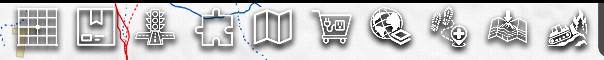
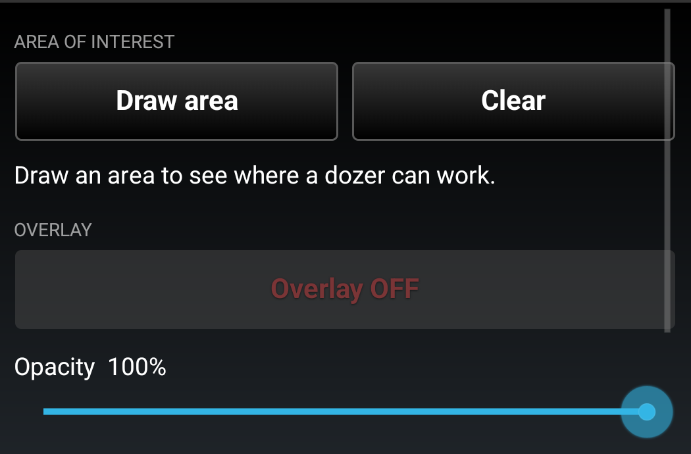
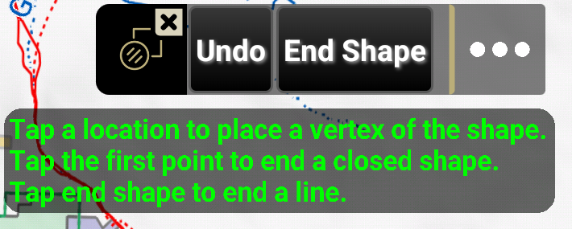
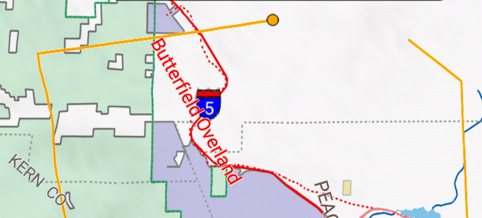
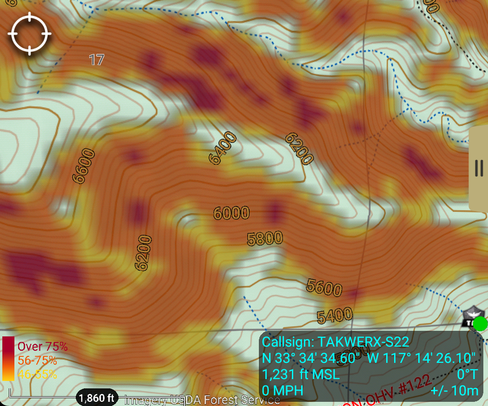
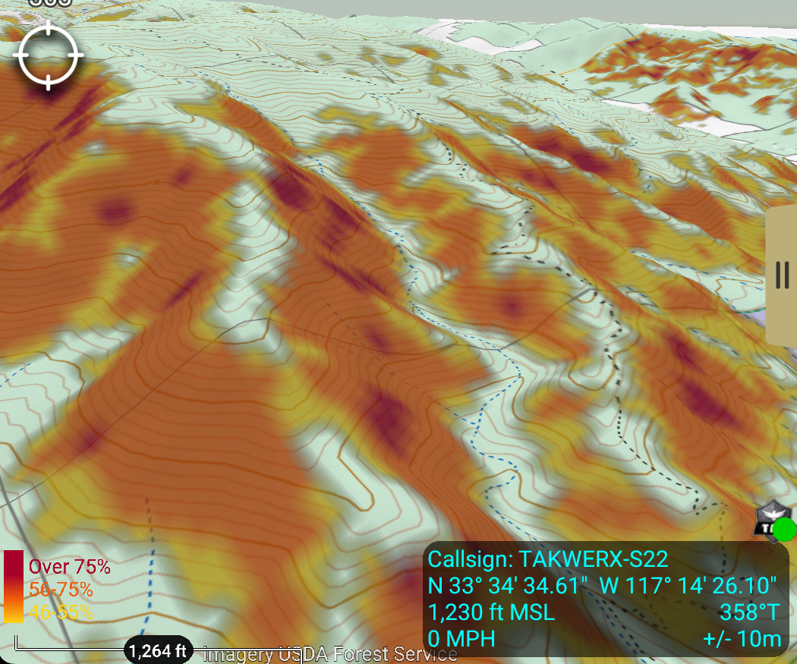
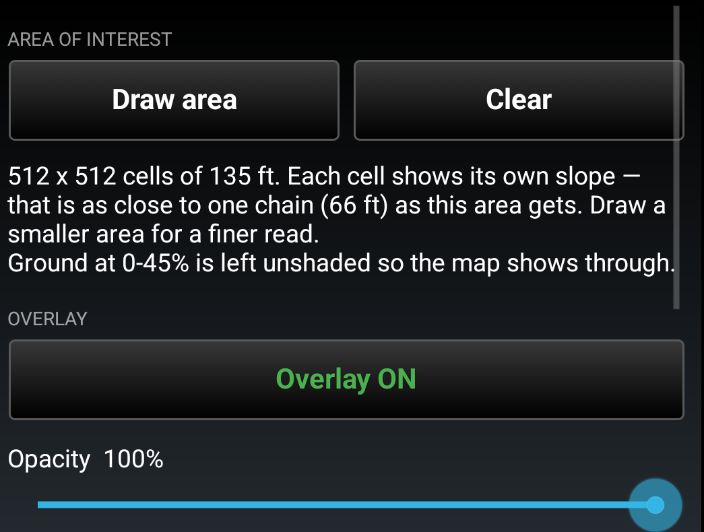
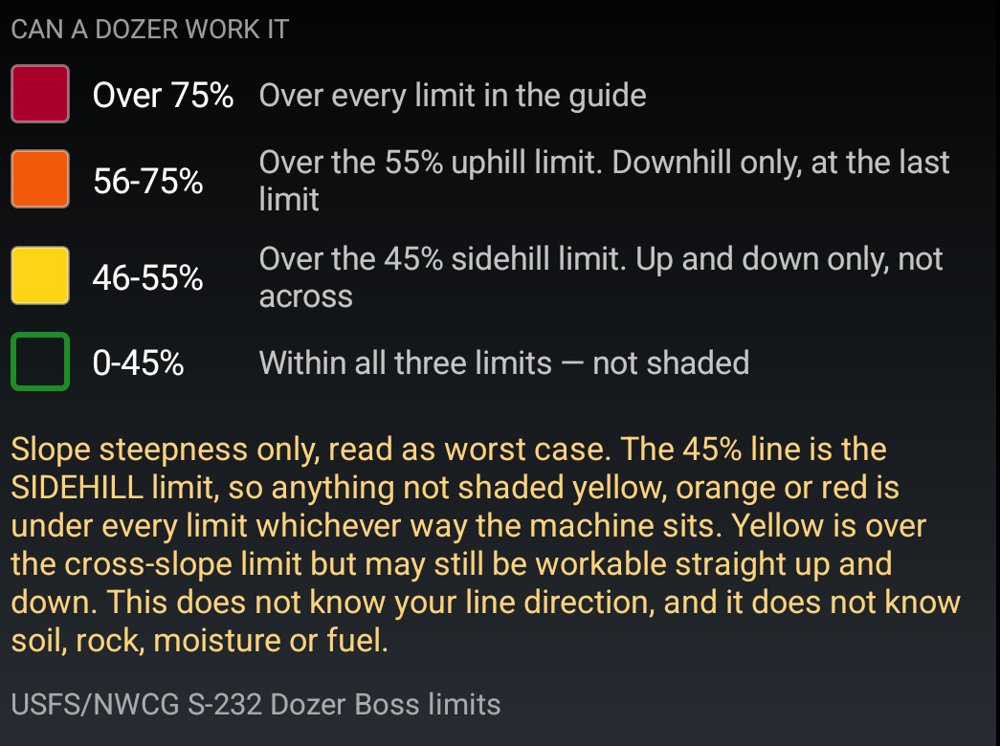
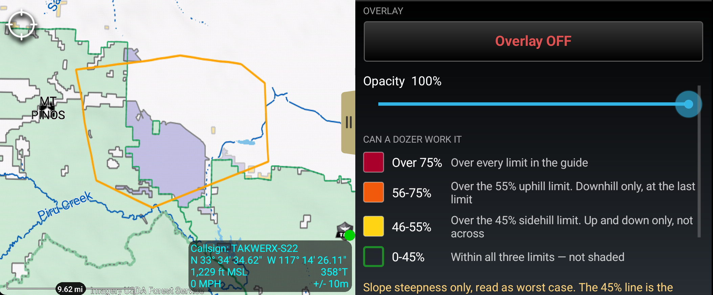
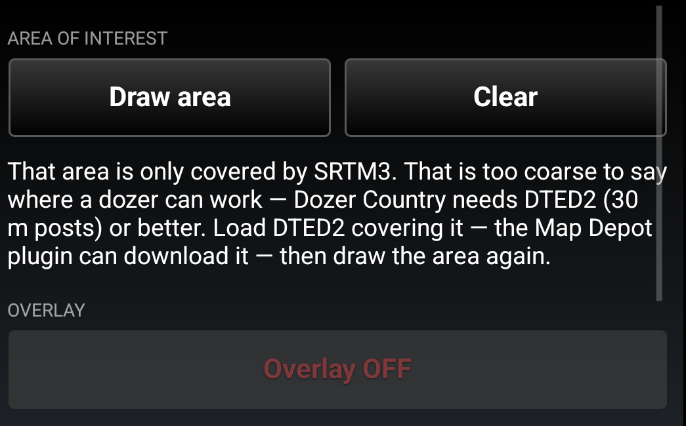

# Dozer Country for ATAK — User Guide

**Version 0.5 · takwerx**

**Download Dozer Country 0.5** (pick the one matching your ATAK-CIV version, sideload, then load it in ATAK's Plugins manager):

- **ATAK-CIV 5.6:** https://github.com/takwerx/dozer-country/releases/download/v0.5/ATAK-Plugin-DozerCountry-0.5--5.6.0-civ-release.apk
- **ATAK-CIV 5.7:** https://github.com/takwerx/dozer-country/releases/download/v0.5/ATAK-Plugin-DozerCountry-0.5--5.7.0-civ-release.apk
- **ATAK-CIV 5.8:** https://github.com/takwerx/dozer-country/releases/download/v0.5/ATAK-Plugin-DozerCountry-0.5--5.8.0-civ-release.apk

All releases: https://github.com/takwerx/dozer-country/releases

Dozer Country answers one question from the map: **can we put a cat in there.**
Draw an area and the ground inside it is shaded against the slope limits a dozer
is held to, so the call can be made from the map rather than from memory of the
ground. It works fully offline, from the elevation already on the device.

---

## 1. The limits it paints

The bands are the refusal points in the NWCG/USFS **S-232 Dozer Boss** course,
Appendix D. Dozers should not be operated:

- **across** slopes over **45 percent** (sidehill)
- **uphill** on slopes over **55 percent**
- **downhill** on slopes over **75 percent**

Dozer Country cannot know which way your line will run, so it reads every cell
as the **worst case** — the sidehill limit. That is the safe direction to be
wrong in.

| Band | Color | What it means |
|---|---|---|
| 0–45% | **not shaded** | Within all three limits, whichever way the machine sits |
| 46–55% | yellow | Over the 45% sidehill limit. Up and down only, not across |
| 56–75% | orange | Over the 55% uphill limit as well. Downhill only, at the last limit |
| Over 75% | red | Over every limit in the guide |

**Ground inside every limit is left unshaded on purpose.** An overlay should not
spend the screen saying "fine", and leaving it bare is what lets you still read
the terrain underneath. Color means something needs looking at.

> This is a **guideline, not a clearance.** Type and size of machine, weather,
> ground conditions and operator experience all move these numbers, and the guide
> says so in the same paragraph the limits come from. It does not know soil,
> rock, moisture or fuel.

---

## 2. Before you start

- **Match the plugin to your ATAK version.** Plugin builds are tied to the ATAK
  release they were built for (5.6, 5.7 and 5.8 builds are published). A
  mismatched build will not load.
- **Install and load the plugin** through ATAK's *Plugins* manager (TAK Package
  Mgmt), the same as any other plugin.
- **You need DTED2 or better** — 30 metre posts — over the ground you are asking
  about. Without it Dozer Country declines rather than guessing. ATAK's own
  elevation manager loads it, and the **Map Depot** plugin can download it.
- **The plugin makes no network calls at all.** No account, no key, no server,
  no CoT. Everything is computed on the device from elevation already on it.

---

## 3. Opening it

Open it from the ATAK toolbar. Tapping the badge again closes the panel, so it
is one tap on and one tap off when you want the map to yourself.

Nothing is computed until you have drawn an area, and the panel says so.

---

## 4. Drawing an area

Press **Draw area**. Dozer Country does not invent a drawing tool — ATAK's own
shape tool takes over, with the prompt, the rubber band, the vertex handles and
the Undo and End Shape buttons you already know.

Tap the map to place each corner.

**Tap the first marker to close the shape.** Pressing *End Shape* instead gives a
line rather than an area; Dozer Country will say so and ask you to close it,
because there is no inside to a line and nothing to shade.

Any shape works — a division, a contingency line, the piece of ground a strike
team is looking at. It does not have to be a box, and the color stops at the ring
you drew rather than at a rectangle around it.

---

## 5. Reading the overlay

The orange outline is the area you drew. Unshaded ground is under every limit;
yellow, orange and red are the exceptions, in the order above.

Tilting into 3D is where it earns its keep — the drainages come up unshaded, the
sidehills yellow and orange, and the noses of the ridges dark red. That is the
shape of the problem rather than a list of percentages.

The shading is an ordinary map layer and follows ATAK's own terrain, so nothing
extra is needed to see it that way.

---

## 6. What the panel tells you

- **The cell size actually used.** Each cell is classed by the *worst slope
  within one chain* (66 ft), not by its own value, so an isolated flat spot
  inside a steep face is never called workable.
- **A large area gives coarse cells.** The panel says the size it managed and
  says to draw a smaller area for a finer read.
- **Anything it could not class** — water, or ground with no elevation — is
  stated as a percentage rather than left as a silent hole.

The classes are listed in the words of the standard, and the hollow swatch is the
band that is deliberately not drawn. The amber paragraph is worth reading twice.

**Overlay** hides and shows the shading without recomputing it; the outline stays
behind so you can still see which ground was worked out. **Clear** removes both.

---

## 7. When it refuses

Dozer Country will not guess. It needs DTED2 — 30 metre posts — or better over
every part of the area. If it has not got it, it declines and tells you what it
found and what to load.

That refusal is what makes the unshaded ground trustworthy: bare map inside an
area always means "under every limit", and never "no data".

Load elevation through ATAK's own elevation manager, or with the **Map Depot**
plugin, then draw the area again.

---

## 8. Worth knowing

- **Water is left unclassed** rather than painted as workable ground. It is found
  by looking for dead-flat ground, so water that ATAK's elevation does not render
  flat can be missed.
- **Bare earth, not canopy.** Slope is read from the terrain model, so the ground
  a blade would sit on, not the top of the timber.
- **The standard is a readable file.** `assets/dozer_data.json` inside the plugin
  carries the bands, the limits and the source they came from, so the numbers a
  color is claiming can be audited by the person whose ground it is.
- **The manual is in the plugin**, at ATAK's *Settings → Tool Preferences → Dozer
  Country*.

---

## 9. Reporting a problem

Issues and requests: https://github.com/takwerx/dozer-country/issues

Useful in a report: the ATAK version, the plugin version, what the panel said,
and roughly where you were working.
