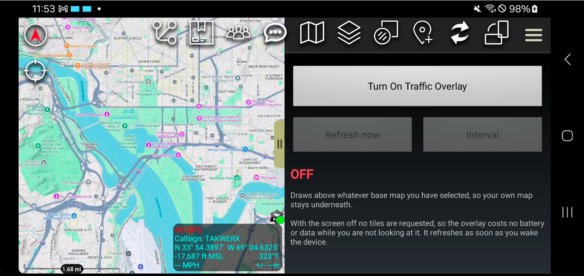
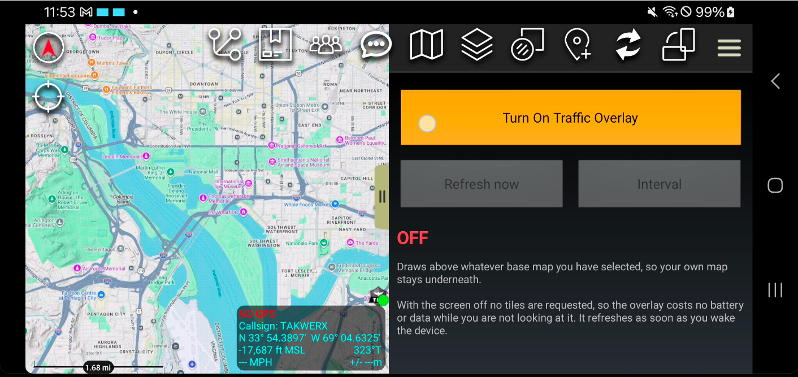
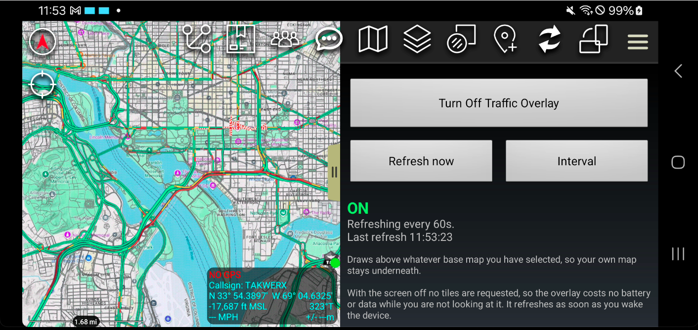
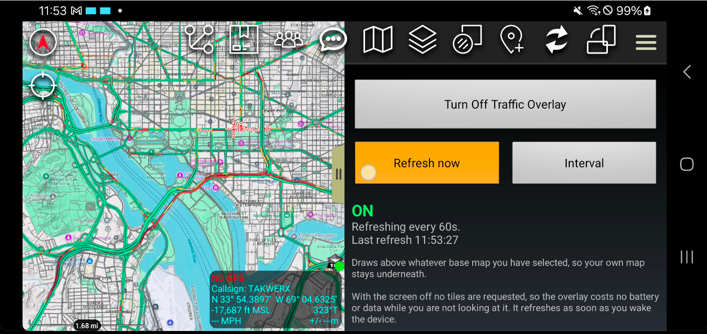
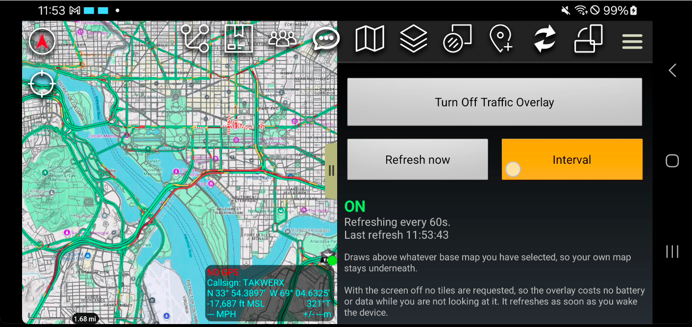
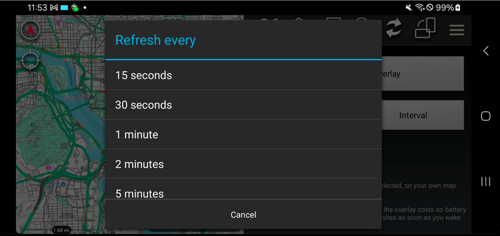
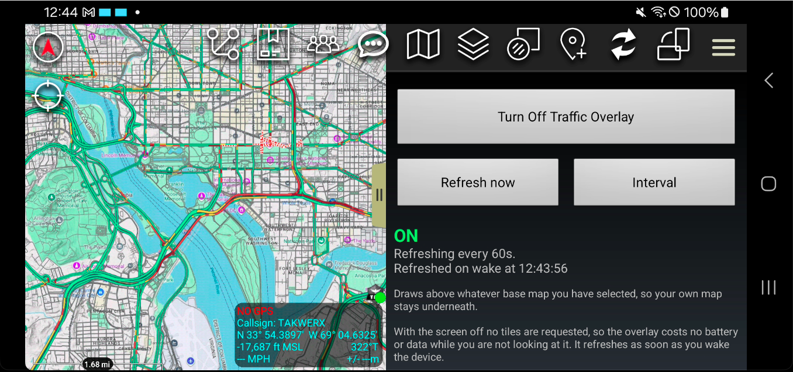

# Traffic for ATAK — User Guide

**Version 0.2 · takwerx**

**Download Traffic 0.2** (pick the one matching your ATAK-CIV version, sideload, then load it in ATAK's Plugins manager):

- **ATAK-CIV 5.7:** https://github.com/takwerx/traffic/releases/download/v0.2/ATAK-Plugin-Traffic-0.2--5.7.0-civ-release.apk
- **ATAK-CIV 5.8:** https://github.com/takwerx/traffic/releases/download/v0.2/ATAK-Plugin-Traffic-0.2--5.8.0-civ-release.apk

All releases: https://github.com/takwerx/traffic/releases

Traffic draws live road traffic on top of the base map you are already using,
and keeps it current while the map sits still.

---

## 1. What this is for, in one minute

ATAK can display an online map source, and a map source can ask to be refreshed
on a timer. That sounds like it should already give you live traffic. It does
not, for two reasons.

**Refreshing only happens while the map is being drawn.** ATAK redraws the map
when something changes — you pan, you zoom, your position moves. A device
sitting on a dash mount or a desk is not drawing anything, so the refresh timer
never comes round and the traffic on screen is however old the last draw left
it. Pan the map and it updates, which is what makes the problem so easy to miss:
the moment you touch it to check, it looks fine.

**And a layered source cannot refresh at all.** The one arrangement you actually
want — traffic drawn over your own imagery or topo — is built without a refresh
interval in the first place.

This plugin owns its own overlay layer and drives the refresh itself, so the
map stays current whether or not anyone is touching it.

> **Traffic is live data.** There is no useful offline mode. Cached tiles are, by
> definition, old traffic — which is worse than no traffic, because it looks
> current.

---

## 2. Before you start

- **Match the plugin to your ATAK version.** Plugin builds are tied to the ATAK
  release they were built for (5.7 and 5.8 builds are published). A mismatched
  build will not load.
- **Install and load the plugin** through ATAK's *Plugins* manager (TAK Package
  Mgmt), the same as any other plugin.
- **Pick your base map first.** The overlay draws on top of whatever you already
  have selected, so choose your imagery, topo or vector map before turning
  traffic on. You can change it afterwards; traffic stays on top.
- **You need a network connection** while the overlay is in use. The plugin
  talks outbound over HTTPS (port 443) only, never to the TAK server, and
  generates no CoT.

---

## 3. Step by step

### Step 1 — Open the plugin

Traffic appears in the Tools list under the hamburger menu at the top right, and
on the ATAK toolbar. The icon is a traffic light over a road.

### Step 2 — The Traffic pane

Three controls and a status line. The state is the first thing on it — **OFF** in
red — so you can tell at a glance without reading. Refresh and Interval are
greyed out until the overlay is on, and opening the pane changes nothing on the
map.

### Step 3 — Turn it on

Tap **Turn On Traffic Overlay**. Traffic appears over your base map within a few
seconds — green where it is moving, amber and red where it is not.

### Step 4 — Your base map is still there

The overlay is transparent apart from the roads themselves, so your own map stays
readable underneath — streets, water, parks, labels. That is the whole point: you
are looking at traffic *in context*, not at a traffic map.

The status now reads **ON** in green, with the interval and the time tiles last
arrived.

### Step 5 — Refresh right now

The overlay refreshes on its own, but tap **Refresh now** if you want the current
picture immediately rather than waiting out the interval. The timestamp updates a
few seconds later, once the new tiles have actually arrived.

### Step 6 — Change how often it refreshes

Tap **Interval**.

Pick anything from 15 seconds to 10 minutes. 60 seconds is the default and suits
most driving; a longer interval is kinder to battery and data on a long shift.

---

## 4. Leave it alone — that is the point

Put the device down and do not touch it. The overlay keeps refreshing on its own,
and the **Last refresh** time keeps advancing. This is what ATAK does not do with
an ordinary online map source: leave that untouched and it quietly freezes at
whatever the last redraw left behind.

Watch the *timestamp*, not the colours. Traffic that has not changed looks
identical refresh after refresh — at three in the morning it will be green for
hours — so the timestamp is how you know it is live.

**"Last refresh" means tiles arrived**, not that the traffic picture changed. If
the network drops, that time stops moving and a warning appears beneath it. That
is the difference between "live" and "a picture of five minutes ago".

### Screen off, and why nothing is wrong

When the screen goes off the overlay stops refreshing and **no tiles are
requested at all** — it costs no battery and no data while nobody is looking at
it.

The moment you wake the device it refreshes, typically within about three seconds
of unlocking, before you have finished reading the map. The status says so
plainly for a couple of minutes afterwards:

> *Refreshed on wake at 12:43:56*

So if you pick the device up and see that line, what you are looking at arrived
after you woke it — not before you put it down.

### Turning it off

Tap **Turn Off Traffic Overlay**. The overlay is removed, the refresh stops, and
all network activity stops with it. Your base map is untouched, and the status
returns to **OFF**.

---

## 5. Good to know

- **Traffic that does not change is not a fault.** At three in the morning the
  picture will look identical refresh after refresh. Watch the *timestamp*, not
  the colours, to know it is live.
- **"Last refresh" means tiles arrived**, not that the traffic picture changed.
  A successful refresh with no change looks the same as no change at all —
  except the timestamp moves.
- **Coverage is wherever the provider has data.** Motorways and major roads are
  well covered in populated areas; expect little or nothing on forest roads and
  in the back country.
- **It costs data.** A refresh fetches the tiles covering your screen. Zoomed
  out over a city at a 15-second interval is the expensive case; a longer
  interval or a tighter zoom costs less.
- **Zoom matters.** Traffic is drawn from about zoom 10 down to street level.
  Zoomed far out you will see motorways only.
- **One overlay at a time.** Turning it on replaces whatever the plugin was
  drawing before; it never stacks two.

---

## 6. Contact

Andreas Johansson, takwerx
https://github.com/takwerx/traffic/issues
